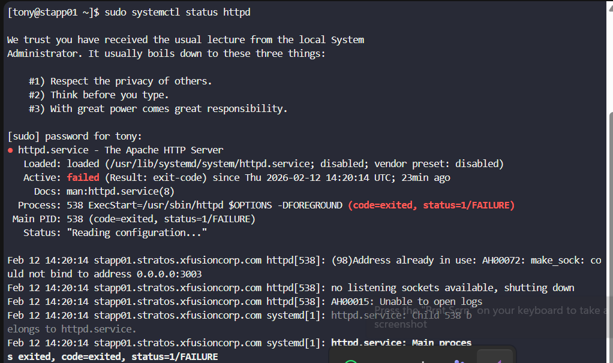
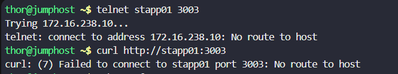
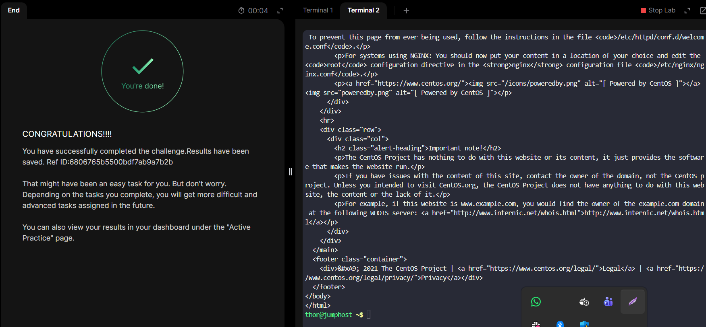

# Day 12 - Linux Network Services

## Task Summary
Apache on **stapp01** is not reachable on **port 3003**.  
Possible causes include:
- Apache service stopped
- Incorrect Apache port configuration
- Firewall restrictions
- Service not listening on expected port

Goal:
- Troubleshoot using tools like `telnet`, `netstat`, `ss`, etc.
- Fix the issue securely
- Ensure connectivity from **jump host**
- Validate with:
```bash
curl http://stapp01:3003
````
Do **not** modify `index.html`.

---

## Step-by-Step Solution

### 1️. Verify Connectivity from Jump Host

```bash
telnet stapp01 3003
# OR
curl http://stapp01:3003
```

If connection fails → move to server-side troubleshooting.

---

### 2️. SSH into App Server

```bash
ssh tony@stapp01
```

---

### 3️. Check Apache Service Status

```bash
sudo systemctl status httpd
# OR
sudo systemctl status apache2
```


This error clearly identifies the root cause:
```
(98)Address already in use:
could not bind to address 0.0.0.0:3003
```

👉 **Meaning:** Another process is already listening on **port 3003**, so Apache cannot bind to it.

---
## Fix — Step-by-Step

### 1️. Identify What Is Using Port 3003

Run:

```bash
sudo ss -tulnp | grep 3003
```

or

```bash
sudo netstat -tulnp | grep 3003
```

Expected output example:

```
tcp   LISTEN  0 128 0.0.0.0:3003  users:(("some_service",pid=xxx))
```

---

### 2️. Determine the Conflicting Process

Look at:

* service name
* PID

Get more detail:

```bash
ps -fp <PID>
```

---

### 3️. Stop the Conflicting Service

```bash
sudo systemctl stop <service_name>
sudo systemctl disable <service_name>
```

If it’s a standalone process:

```bash
sudo kill -9 <PID>
```

---

### 4️. Verify Port Is Free

```
sudo ss -tulnp | grep 3003
```

👉 No output = port free.

---

### 5️. Start Apache

```bash
sudo systemctl start httpd
sudo systemctl enable httpd
sudo systemctl status httpd
```

You want:

```
Active: active (running)
```

---

## Challenge
### Apache is unreachable from the jump host


### Ensure Firewall Is Not Blocking Access

Since firewall-cmd is missing, check iptables:
```
sudo iptables -L -n
```

If INPUT policy is DROP or REJECT, allow port 3003:
```
sudo iptables -I INPUT -p tcp --dport 3003 -j ACCEPT
```

(Does not weaken security — only opens required port.)

 Validate Connectivity from Jump Host

Now go to jump host:
```
curl http://stapp01:3003
```

Expected:
HTML page returned.



Optional test:
```
telnet stapp01 3003
```

Connection should establish.

## Outcome

Apache becomes reachable securely on port 3003, restoring monitoring visibility and application availability without altering application content.
