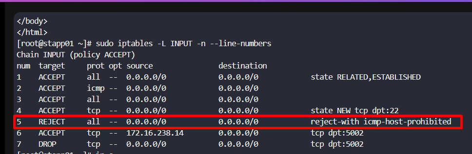
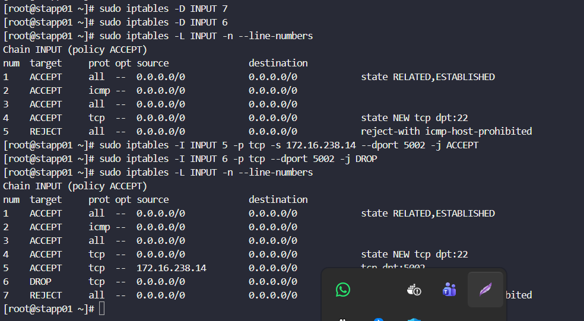
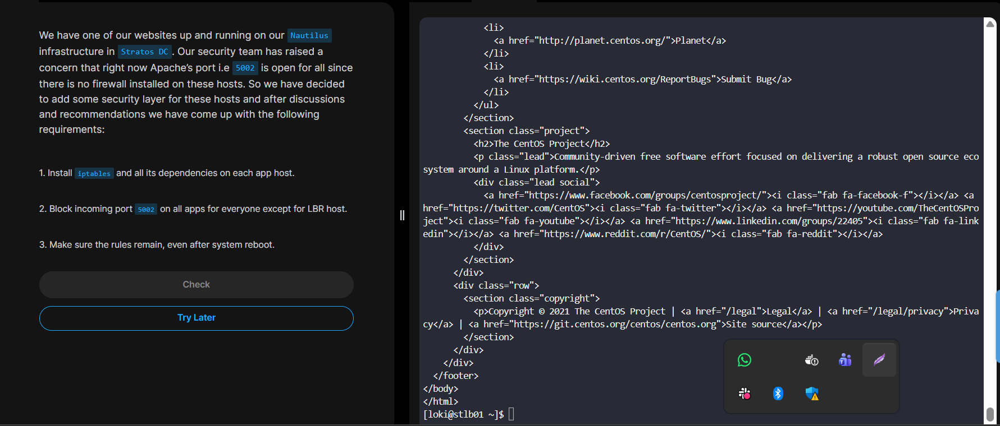

# Day 13 - IPTables Installation and Configuration  


## Task Overview
The security team identified that Apache port **5002** is open to all hosts because no firewall is configured.  
Your responsibility is to:

1. Install `iptables` and dependencies on all **app servers**.
2. Allow access to port **5002** only from the **LBR host**.
3. Ensure firewall rules persist after reboot.

---


## Step-by-Step Solution

### 1️. Install IPTables
Run on **each app server**:

```bash
sudo yum install -y iptables iptables-services
````

Enable and start the service:

```bash
sudo systemctl enable iptables
sudo systemctl start iptables
```

Verify:

```bash
sudo systemctl status iptables
```

---

### 2️. Configure Firewall Rules

#### Allow LBR Host to Access Port 5002

Replace `<LBR_IP>` with the LBR host IP:

```bash
sudo iptables -A INPUT -p tcp -s <LBR_IP> --dport 5002 -j ACCEPT
```

#### Block Everyone Else

```bash
sudo iptables -A INPUT -p tcp --dport 5002 -j DROP
```

---

### 3️. Save Rules for Persistence

Ensure rules survive reboot:

```bash
sudo service iptables save
```

Verify rules:

```bash
sudo iptables -L -n
```

---

### 4️. Test Connectivity

* From **LBR Host** → Access should work.
* From any other host → Access should be blocked.


```bash
curl http://<APP_SERVER_IP>:5002
```

## Error Encountered
```
Faild to connect to App_server from LBR!
No route to host
```


---


The issue is clearly visible from the rule set.




👉 **Rule #5 is the problem:**

```
5 REJECT all -- 0.0.0.0/0 0.0.0.0/0 reject-with icmp-host-prohibited
```

iptables evaluates rules **top-down**.
Traffic to port **5002** never reaches rules **6** and **7** because it is already rejected at rule **5** — which explains the:

```
No route to host
```

error from the LBR host.

---

## Root Cause (Technical)

* Rule 5 is a blanket reject.
* Your allow rule for the LBR host is **below** it.
* Therefore all packets are rejected before matching the allow rule.

---

##  Fix — Correct Rule Placement

### Step 1 — Remove Current 5002 Rules

```bash
sudo iptables -D INPUT 7
sudo iptables -D INPUT 6
```

---

### Step 2 — Insert Rules **Before** Rule 5

Insert allow rule first:

```bash
sudo iptables -I INPUT 5 -p tcp -s 172.16.238.14 --dport 5002 -j ACCEPT
```

Insert drop rule immediately after:

```bash
sudo iptables -I INPUT 6 -p tcp --dport 5002 -j DROP
```

---

### Step 3 — Verify Correct Order

```bash
sudo iptables -L INPUT -n --line-numbers
```

Expected structure:

```
1 ACCEPT RELATED,ESTABLISHED
2 ACCEPT icmp
3 ACCEPT all
4 ACCEPT ssh
5 ACCEPT tcp 172.16.238.14 dpt:5002
6 DROP   tcp anywhere dpt:5002
7 REJECT all reject-with icmp-host-prohibited
```


---

### Step 4 — Save Persistence

```bash
sudo service iptables save
```

---

## Test Again from LBR

```bash
curl http://stapp01:5002
```


---

## Expected Result After Fix

* LBR host → access works
* Other hosts → blocked
* No more "No route to host" error

---

## Summary

This task improves production security by restricting application exposure and enforcing controlled access using host-based firewall rules.

