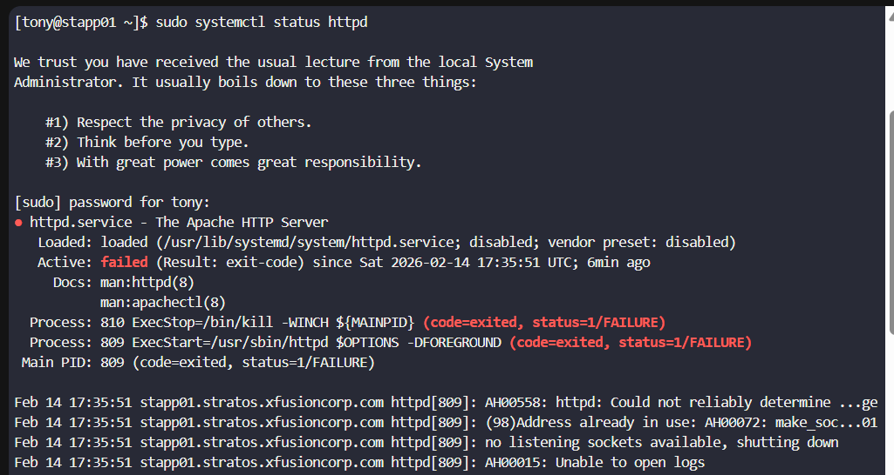
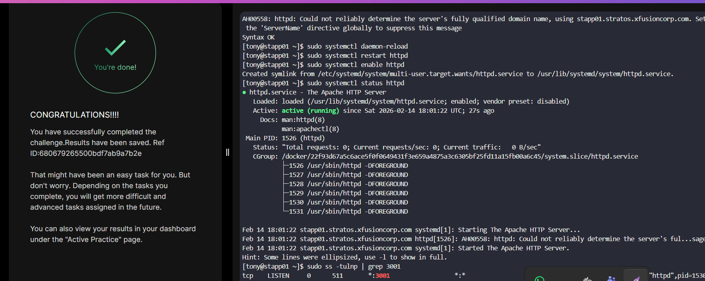

# Day 14 – Linux Process Troubleshooting (KodeKloud 100DaysOfDevOps)

## Task
The production support team of xFusionCorp Industries has deployed some of the latest monitoring tools to keep an eye on every service, application, etc. running on the systems. One of the monitoring systems reported about Apache service unavailability on one of the app servers in Stratos DC.  

Identify the faulty app host and fix the issue. Make sure Apache service is up and running on all app hosts. They might not have hosted any code yet on these servers, so you don’t need to worry if Apache isn’t serving any pages. Just make sure the service is up and running. Also, make sure Apache is running on port 3001 on all app servers.


##  Task Objective
- Identify the faulty **app server** where Apache is down.
- Fix the issue and ensure **Apache is running on all app servers**.
- Configure Apache to listen on **port 3001**.
- Confirm the service is active and enabled.
---

##  Step-by-Step Solution

### 1️. Login to Jump Host
```bash
ssh <jump-host-user>@jump_host
````
---

### 2️. Identify All App Servers

Check inventory or known hostnames:

```bash
cat /etc/hosts
```

Example:
```
stapp01
stapp02
stapp03
```

---

### 3️. Check Apache Status on Each App Server

SSH into each server:

```bash
ssh <user>@stapp01
```

Check service status:

```bash
sudo systemctl status httpd
# or
sudo systemctl status apache2
```

Look for:

* inactive
* failed
* dead

The server with a failed service is the faulty host.

The faulty host is app_server01.



The error tells that the root cause is **not a service crash**, but a **port binding conflict**.

Key log line:

```
(98)Address already in use
no listening sockets available
```

👉 Apache is trying to start on a port that is **already occupied by another process**.

Since the task requires Apache to run on **port 3001**, here’s the precise troubleshooting workflow.

---

## Step 1 - Identify What is Using the Port

Check which process owns the conflicting port:

```bash
sudo ss -tulnp | grep 3001
```

or

```bash
sudo netstat -tulnp | grep 3001
```

Example output:

```
tcp LISTEN 0 128 *:3001 users:(("nginx",pid=456,...))
```

👉 Note the **PID** and **process name**.

---

##  Step 2 - Confirm Apache Configuration

Verify Apache is actually set to port 3001:

```bash
sudo grep -i listen /etc/httpd/conf/httpd.conf
```

Expected:

```
Listen 3001
```

If multiple Listen directives exist:

```bash
sudo vi /etc/httpd/conf/httpd.conf
```

Remove duplicates like:

```
Listen 80
Listen 3001
```

Leave only:

```
Listen 3001
```

---

## Step 3 - Stop the Conflicting Process

If another service is using port 3001:

Identify it:

```bash
ps -fp <PID>
```

Stop it:

```bash
sudo systemctl stop <service-name>
```

Or kill process directly:

```bash
sudo kill -9 <PID>
```

---

## Step 4 - Validate Apache Configuration Syntax

Before restarting:

```bash
sudo httpd -t
```

Expected output:

```
Syntax OK
```

If errors appear → fix configuration first.

---

## Step 5 - Restart Apache

```bash
sudo systemctl daemon-reload
sudo systemctl restart httpd
```

Enable service:

```bash
sudo systemctl enable httpd
```

---

## Step 6 - Verify Apache is Running

Check service:

```bash
sudo systemctl status httpd
```

Check port binding:

```bash
sudo ss -tulnp | grep 3001
```

Expected:

```
httpd LISTEN *:3001
```

---

## About This Warning (Not Critical)

```
Could not reliably determine server's fully qualified domain name
```

This is **not fatal**. If you want to silence it:

```bash
sudo vi /etc/httpd/conf/httpd.conf
```

Add:

```
ServerName localhost
```

---

## Root Cause Summary

* Apache failed because **another process occupied the configured port**
* Apache could not bind → service exited with failure
* Freeing the port + validating configuration resolves it


