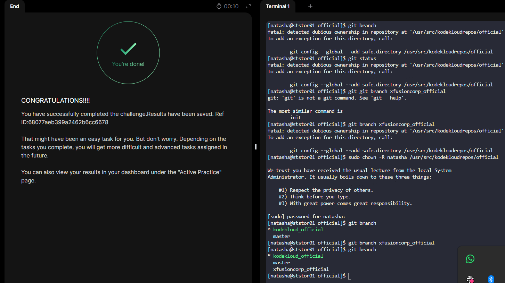

# Day 24 - Git Create Branches

## Task Overview
The Nautilus development team required a new feature branch to isolate upcoming application enhancements.  

**Objective:**  
On the Storage Server (Stratos DC), create a new branch `xfusioncorp_official` from the `master` branch in the Git repository located at:

```
/usr/src/kodekloudrepos/official
```

> No code modifications were required - branch creation only.

---

## Implementation Steps

### 1️. Switch to Storage Server
```bash
ssh natasha@ststor01
````

### 2️. Navigate to Repository

```bash
cd /usr/src/kodekloudrepos/official
```

### 3️. Verify Current Branch

```bash
git branch
```

Ensure you are on the `master` branch.

### 4️. Create New Branch from Master

```bash
git checkout -b xfusioncorp_official master
```

### 5️. Confirm Branch Creation

```bash
git branch
```

Expected output:

```
* xfusioncorp_official
  master
```


---

## Challenge Encountered

While attempting to access the repository, Git returned:

```
fatal: detected dubious ownership in repository at '/usr/src/kodekloudrepos/official'
```

### Root Cause

Git security (introduced in newer versions) prevents operations on repositories owned by another user to mitigate privilege escalation risks.

### Resolution

The repository ownership was assigned to the correct user account:

```bash
sudo chown -R natasha /usr/src/kodekloudrepos/official
```

After correcting ownership, Git operations executed successfully.

---

## Key Takeaways

* Branching enables isolated feature development following Git best practices.
* Git's security model enforces repository ownership validation.
* Proper file system permissions are critical in production-like environments.

This task reinforces structured version control workflows and operational troubleshooting within a Linux-based DevOps environment.

