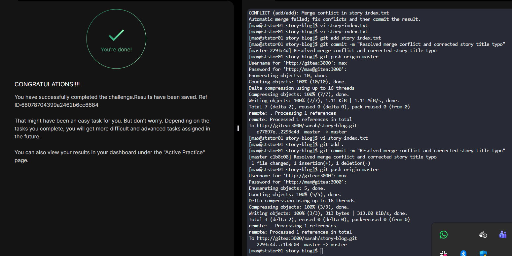

# Day 33 - Resolve Git Merge Conflicts

## Task Overview
Max attempted to push recent updates to the **story-blog** repository but encountered a **merge conflict** because Sarah had already pushed changes to the remote repository. The goal is to **pull the latest changes, resolve the merge conflict, fix a typo, ensure all four story titles exist, and successfully push the update**.

This is a common **real-world DevOps scenario** where multiple engineers modify the same file and conflicts must be resolved before integration.

---

## Step 1: SSH into the Storage Server
Login as **max**.

```bash
ssh max@ststor01
# password
```

---

## Step 2: Navigate to the Repository

```bash
cd /home/max/story-blog
```

Check the repository status:

```bash
git status
```

---

## Step 3: Attempt to Push Changes

```bash
git push origin master
```

You will see an error similar to:

```
Updates were rejected because the remote contains work that you do not have locally
```

This means the **remote repository has new commits from Sarah**.

---

## Step 4: Pull Latest Changes

```bash
git pull origin master
```

During the pull, **Git will report a merge conflict** in:

```
story-index.txt
```

---

## Step 5: Identify the Conflict

Open the file:

```bash
vi story-index.txt
```

You will see conflict markers like:

```
<<<<<<< HEAD
content from max
=======
content from sarah
>>>>>>> branch
```

---

## Step 6: Resolve the Conflict

Edit the file so that it:

1. **Contains titles of all four stories**
2. Fix the typo:

   * `The Lion and the Mooose` → `The Lion and the Mouse`
3. Remove the conflict markers:

   ```
   <<<<<<<
   =======
   >>>>>>>
   ```

Example final structure:

```
1. The Lion and the Mouse
2. The Turtle and the Rabbit
3. The Fox and the Grapes
4. The Ant and the Grasshopper
```

Save and exit.

---

## Step 7: Stage the Fixed File

```bash
git add story-index.txt
```

---

## Step 8: Commit the Merge Resolution

```bash
git commit -m "Resolved merge conflict and corrected story title typo"
```

---

## Step 9: Push Changes Successfully

```bash
git push origin master
```

The push should now succeed.

---

## Verification

You can confirm the update via **Gitea UI**:

Login with:

* **Username:** max
* **Password:** 

or

* **Username:** sarah
* **Password:** 

Check the **story-index.txt** file to verify:

* All **4 stories exist**
* **Mouse typo is corrected**


---

## Key Learnings

- Merge conflicts occur when multiple developers modify the same lines in a file
- git pull can trigger merge conflicts if remote changes exist
- Conflict markers must be manually reviewed and resolved
- Files must be staged again after resolving conflicts
- Conflict resolution should preserve required changes from all contributors
- Verifying changes via the Git UI helps confirm successful collaboration

---

## Key DevOps Takeaway

Merge conflicts are **inevitable in collaborative development environments**. Knowing how to **identify conflict markers, reconcile competing changes, and safely merge code** is critical for maintaining stable production pipelines and preventing integration failures.
