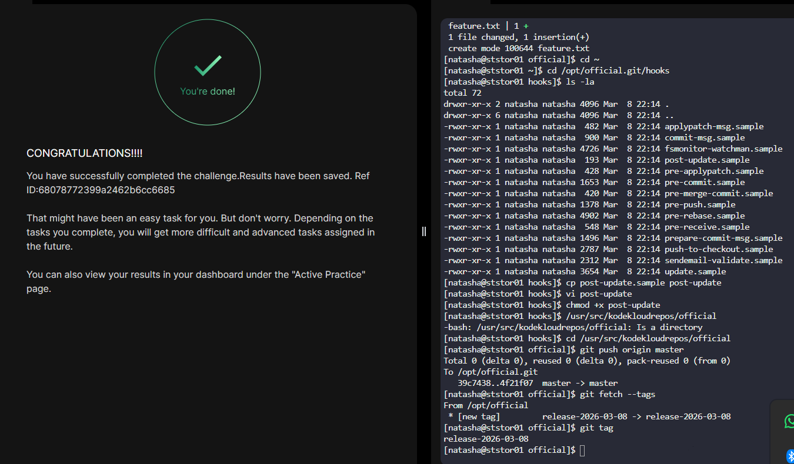

# Day 34 - Git Hooks: Automatic Release Tag Creation

## Task/Requirement

The Nautilus application development team was working on a git repository /opt/official.git which is cloned under /usr/src/kodekloudrepos directory present on Storage server in Stratos DC. The team want to setup a hook on this repository, please find below more details  

Merge the feature branch into the master branch, but before pushing your changes complete below point.  

Create a post-update hook in this git repository so that whenever any changes are pushed to the master branch, it creates a release tag with name release-2023-06-15, where 2023-06-15 is supposed to be the current date. For example if today is 20th June, 2023 then the release tag must be release-2023-06-20. Make sure you test the hook at least once and create a release tag for today's release.  

Finally remember to push your changes.  

Note: Perform this task using the natasha user, and ensure the repository or existing directory permissions are not altered.

---

## Objective

In this task, we merge the `feature` branch into `master` and configure a **post-update Git hook** on the **bare repository** so that whenever changes are pushed to `master`, a **release tag with the current date** is automatically created (e.g., `release-2023-06-20`). This reflects production workflows where releases are automatically versioned during deployments.

---

## 1. Login to Storage Server

```bash
ssh natasha@ststor01
```

---

## 2. Navigate to Working Repository

```bash
cd /usr/src/kodekloudrepos/official
```

Verify branches:

```bash
git branch
```

---

## 3. Merge Feature Branch into Master

```bash
git checkout master
git merge feature
```

---

## 4. Go to Bare Repository Hooks Directory

The hook must be placed in the **bare repo**, because push events trigger hooks on the remote repository.

```bash
cd /opt/official.git/hooks
```

---

## 5. Create the post-update Hook

```bash
cp post-update.sample post-update
vi post-update
```

Replace its contents with:

```bash
#!/bin/bash

current_date=$(date +%F)
git tag release-$current_date
```

Save and exit.

---

## 6. Make Hook Executable

```bash
chmod +x post-update
```

---

## 7. Push Changes to Trigger the Hook

Return to the working repository and push:

```bash
cd /usr/src/kodekloudrepos/official
git push origin master
```

---

## 8. Verify Tag Creation

```bash
git fetch --tags
git tag
```

Expected output:

```
release-YYYY-MM-DD
```

Example:

```
release-2023-06-20
```

---

## Key Learnings

- Git hooks automate actions in response to Git events
- post-update is a server-side hook triggered after a successful push
- Branch names map to internal references like master = refs/heads/master
- Hooks must be executable to function correctly
- Bare repositories are the correct place for server-side hooks
- Automated tagging improves release consistency and traceability