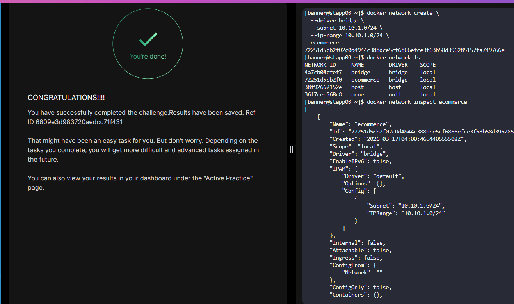

# Day 42 – Create a Docker Network

## Task Overview
Provision a custom Docker network on **App Server 3** with specific networking constraints for future containerized workloads.

---

## Objective
Create a Docker network with the following specifications:
- **Name:** `ecommerce`
- **Driver:** `bridge`
- **Subnet:** `10.10.1.0/24`
- **IP Range:** `10.10.1.0/24`

---

## Steps to Execute

### 1. Connect to App Server 3
```bash
ssh banner@stapp03
```

---

### 2. Create the Docker Network

Run the following command:

```bash
docker network create \
  --driver bridge \
  --subnet 10.10.1.0/24 \
  --ip-range 10.10.1.0/24 \
  ecommerce
```

---

### 3. Verify the Network

Confirm the network was created successfully:

```bash
docker network ls
```

Inspect for deeper validation:

```bash
docker network inspect ecommerce
```

---

## Expected Outcome

* A custom bridge network named `ecommerce` is available.
* It uses the defined subnet and IP range.
* Ready for container attachment in isolated environments.


---

## Notes

* Using a **custom bridge network** enables better control over container communication compared to the default bridge.
* This setup is commonly used in **production environments** for microservices isolation and predictable IP management.

## Key Learnings

- Docker networks define how containers communicate with each other and with external systems
- Docker provides built-in network drivers: bridge, host, overlay, macvlan, and none
- bridge is the default Docker network used when no network is specified
- macvlan allows containers to get IP addresses directly from the physical network
- Custom subnets and IP ranges provide predictable and controlled IP assignment
- The parent interface specifies which host NIC is used by a macvlan network
- docker network create is used to create custom networks
- docker network ls lists all available Docker networks
- docker network inspect shows detailed configuration of a network
- Containers can be attached to a network at runtime using --network