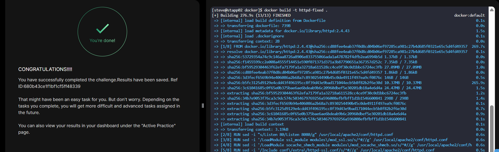

# Day 45 - Resolve Dockerfile Issues

## Objective
Fix a broken Dockerfile on **App Server 2** so it builds successfully without modifying the base image or application data.

---

## Step 1: Navigate to Dockerfile Location
```bash
cd /opt/docker
ls
```

---

## Step 2: Identify the Issues

###  Original (Broken) Dockerfile

```dockerfile
FROM httpd:2.4.43

RUN sed -i "s/Listen 80/Listen 8080/g" /usr/local/apache2/conf.d/httpd.conf

RUN sed -i '/LoadModule\ ssl_module modules\/mod_ssl.so/s/^#//g' conf.d/httpd.conf

RUN sed -i '/LoadModule\ socache_shmcb_module modules\/mod_socache_shmcb.so/s/^#//g' conf.d/httpd.conf

RUN sed -i '/Include\ conf\/extra\/httpd-ssl.conf/s/^#//g' conf.d/httpd.conf

COPY certs/server.crt /usr/local/apache2/conf/server.crt

COPY certs/server.key /usr/local/apache2/conf/server.key

COPY html/index.html /usr/local/apache2/htdocs/
~
```

---

## Problems Identified

* ❌ **Invalid config path**: `conf.d/httpd.conf` does not exist in `httpd:2.4.43`
* ❌ **Incorrect absolute path**: `/usr/local/apache2/conf.d/httpd.conf` is wrong
* ❌ **All `sed` commands targeting wrong file**
* ❌ **Invalid trailing character (`~`)** breaking Dockerfile syntax

---

## Step 3: Apply Fixes

### Corrected Dockerfile

```dockerfile
FROM httpd:2.4.43

# Update Apache to listen on port 8080
RUN sed -i "s/Listen 80/Listen 8080/g" /usr/local/apache2/conf/httpd.conf

# Enable required SSL modules
RUN sed -i '/LoadModule ssl_module modules\/mod_ssl.so/s/^#//g' /usr/local/apache2/conf/httpd.conf
RUN sed -i '/LoadModule socache_shmcb_module modules\/mod_socache_shmcb.so/s/^#//g' /usr/local/apache2/conf/httpd.conf

# Enable SSL configuration include
RUN sed -i '/Include conf\/extra\/httpd-ssl.conf/s/^#//g' /usr/local/apache2/conf/httpd.conf

# Copy SSL certificates
COPY certs/server.crt /usr/local/apache2/conf/server.crt
COPY certs/server.key /usr/local/apache2/conf/server.key

# Copy application content
COPY html/index.html /usr/local/apache2/htdocs/
```

---

## What Was Corrected

| Issue                                   | Fix                                                |
| --------------------------------------- | -------------------------------------------------- |
| Wrong config path (`conf.d/httpd.conf`) | Replaced with `/usr/local/apache2/conf/httpd.conf` |
| Invalid absolute path                   | Corrected to proper Apache config location         |
| Broken `sed` targets                    | All now point to the correct file                  |
| Invalid `~` character                   | Removed                                            |

---

## Step 4: Build the Image

```bash
docker build -t httpd-fixed .
```

---

## Step 5: Verify

```bash
docker run -d -p 8080:8080 httpd-fixed
```

---

## Outcome

The Dockerfile now builds successfully and aligns with production-grade practices while respecting all constraints:

* Base image unchanged
* Application data untouched
* Only configuration issues resolved

---

## Key Learnings

- FROM must be the first valid instruction in a Dockerfile
- ADD and COPY are used only for copying files into images
- COPY is preferred for simple file copying, while ADD supports additional features like URL downloads and archive extraction
- Shell commands must be executed using the RUN instruction
- Misusing Dockerfile instructions leads to build-time failures
- CMD provides default arguments for a container and can be overridden at runtime
- ENTRYPOINT defines the main command that always runs when the container starts
- CMD works best for flexible commands, while ENTRYPOINT is used for fixed executables
- Debugging Dockerfiles often involves understanding instruction intent
