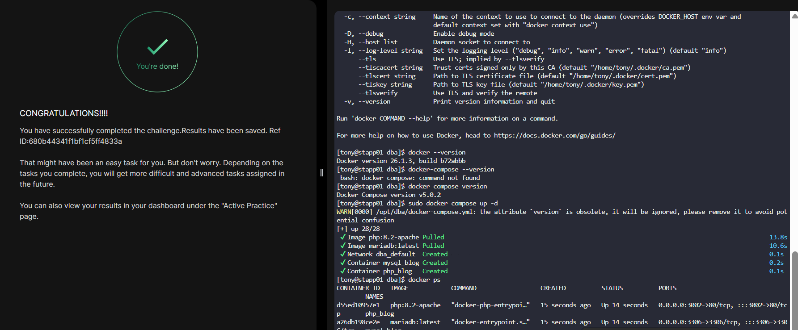

# Day 46: Deploy an App on Docker Containers

## Task / Requirement
The Nautilus Application development team recently finished development of one of the apps that they want to deploy on a containerized platform. The Nautilus Application development and DevOps teams met to discuss some of the basic pre-requisites and requirements to complete the deployment. The team wants to test the deployment on one of the app servers before going live and set up a complete containerized stack using a docker compose fie. Below are the details of the task:

On App Server 1 in Stratos Datacenter create a docker compose file /opt/dba/docker-compose.yml (should be named exactly). The compose should deploy two services (web and DB), and each service should deploy a container as per details below:

### Requirement details:

- Server: Application Server 1 (stapp01)
- Docker Compose file path: /opt/dba/docker-compose.yml
- Services: Web + Database

### Web Service
- Container name: php_apache
- Image: php (Apache variant)
- Host port: 3002
- Container port: 80
- Volume mapping:
    - Host: /var/www/html
    - Container: /var/www/html

### Database Service
- Container name: mysql_apache
- Image: mariadb:latest
- Host port: 3306
- Container port: 3306
- Volume mapping:
    - Host: /var/lib/mysql
    - Container: /var/lib/mysql
- Environment variables:
    - MYSQL_DATABASE=database_apache
    - Custom database user (non-root) with a complex password


This task demonstrates how to deploy a simple two-tier application stack (PHP + MariaDB) using **Docker Compose**, simulating a production-like containerized setup.

---

## Objective

Create a Docker Compose file that:

* Deploys a **web (PHP Apache)** service
* Deploys a **database (MariaDB)** service
* Configures networking, volumes, and environment variables correctly

---

## Step 1: Create Compose File

On **App Server 1**, create the required file:

```bash
sudo mkdir -p /opt/dba
sudo vi /opt/dba/docker-compose.yml
```

---

## Step 2: Define Services

Add the following configuration:

```yaml
version: '3.8'

services:
  web:
    image: php:8.2-apache
    container_name: php_blog
    ports:
      - "3002:80"
    volumes:
      - /var/www/html:/var/www/html
    depends_on:
      - db

  db:
    image: mariadb:latest
    container_name: mysql_blog
    ports:
      - "3306:3306"
    volumes:
      - /var/lib/mysql:/var/lib/mysql
    environment:
      MYSQL_DATABASE: database_blog
      MYSQL_USER: blog_user
      MYSQL_PASSWORD: StrongPass123!
      MYSQL_ROOT_PASSWORD: RootPass123!
```

---

## Step 3: Deploy the Stack

Run the following command:

```bash
cd /opt/dba
docker-compose up -d
```

This will:

* Pull required images
* Create and start both containers
* Establish communication between services

---

## Step 4: Verify Deployment

Check running containers:

```bash
docker ps
```

You should see:

* `php_blog`
* `mysql_blog`


---

## Key Concepts

* **Port Mapping**: Exposes container services to host (`3002 → 80`, `3306 → 3306`)
* **Volumes**: Ensures persistent data storage
* **Environment Variables**: Used to initialize the database
* **Service Dependency**: `depends_on` ensures DB starts before web

---

## Outcome

You successfully deployed a containerized application stack using Docker Compose, replicating a real-world DevOps deployment pattern with service isolation and persistence.

---

## Key Learnings

- Docker Compose can deploy multi-container application stacks
- Services are defined declaratively in a YAML file
- Containers can communicate internally using service names
- Port mapping exposes container services to the host
- Volume mounts persist application and database data
- Environment variables are used to configure containers at runtime
- `docker compose up -d` starts all services in detached mode