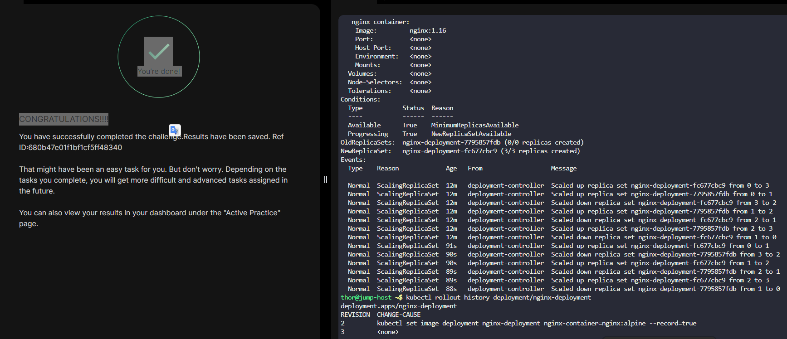

# Day 52 - Revert Deployment to Previous Version in Kubernetes

## Task/Requirement
The Nautilus DevOps team deployed a new release for an application. However, a customer has reported a bug related to this recent release. Consequently, the team aims to revert to the previous version.

## Requirement details:
- Deployment name: nginx-deployment
- Action: Roll back to the previous revision
- Kubernetes access: kubectl configured on jump host

##  Objective
Rollback a Kubernetes deployment to its previous revision after a faulty release.

---

## Steps to Perform Rollback

### 1. Verify Existing Deployment

Check that the deployment exists:

```bash
kubectl get deployments
```

---

### 2. Check Deployment Revision History

View rollout history to confirm available revisions:

```bash
kubectl rollout history deployment/nginx-deployment
```

---

### 3. Rollback to Previous Revision

Revert to the last stable version:

```bash
kubectl rollout undo deployment/nginx-deployment
```

---

### 4. Confirm Rollback Status

Ensure the rollback was successful:

```bash
kubectl rollout status deployment/nginx-deployment
```

---

### 5. Validate Running Pods

Confirm pods are running the expected version:

```bash
kubectl get pods
```

For deeper inspection

```bash
kubectl describe deployment nginx-deployment
```

---

##  Outcome
* Deployment nginx-deployment is rolled back to the previous version
* New Pods are created using the earlier image/version
* Faulty Pods from the newer release are terminated
* All Pods reach the Running state after rollback
* Rollout history reflects the rollback action as a new revision

---

## Key Learnings
- Kubernetes Deployments maintain a revision history automatically
- `kubectl rollout undo` reverts a Deployment to the previous revision
- Rollbacks create a new revision entry in `rollout history`
- Rollout history helps identify and audit deployment changes
- Kubernetes enables fast recovery from faulty releases without downtime
- Rollback is a safe and preferred way to recover from failed updates
