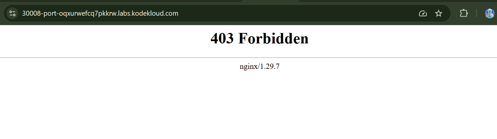
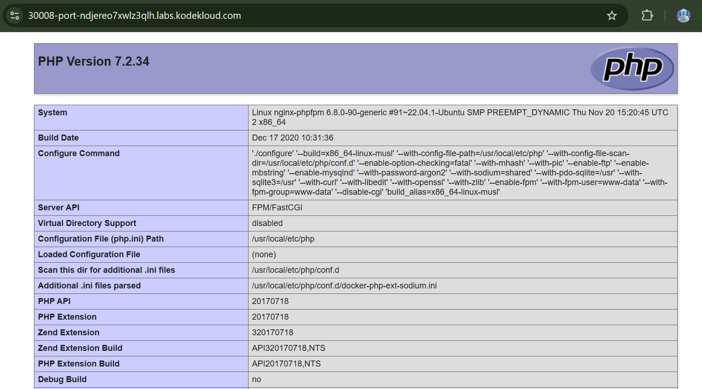

# Day 53 - Resolve VolumeMounts Issue in Kubernetes

## Task / Requirement
An Nginx + PHP-FPM application running on Kubernetes stopped working due to a configuration issue. The application returned HTTP 403 errors and needed investigation.

The task was to identify and fix the issue related to volume mounts and configuration, then deploy the application content so that the website becomes accessible again.

### Environment Details:
- **Pod Name:** `nginx-phpfpm`
- **ConfigMap:** `nginx-config`
- **Stack:** Nginx + PHP-FPM (multi-container Pod)
- Copy file: `/home/thor/index.php` to nginx container document root

---

## Root Cause
The application failed due to a **document root mismatch** between containers:

- Nginx was configured (via ConfigMap) to serve content from: `/var/www/html`

- PHP-FPM container mounted the shared volume at: `/usr/share/nginx/html`

Because both containers referenced **different mount paths**, they were not operating on the same filesystem location. As a result:
- Nginx could not find the PHP file
- Requests returned **403 Forbidden**



---

## Solution Steps

### 1. Inspect the Pod

```bash
kubectl get pods
kubectl describe pod nginx-phpfpm
```
### 2. Check Logs
```
kubectl logs nginx-phpfpm
kubectl logs nginx-phpfpm -c nginx-container
kubectl logs nginx-phpfpm -c php-fpm-container
```
Observation: Nginx returning 403 Forbidden

### 3. Verify ConfigMap
```
kubectl get cm nginx-config -o yaml
```
Confirmed Nginx is serving from `/var/www/html`

### 4. Export and Fix Pod Definition
```
kubectl get pod nginx-phpfpm -o yaml > pod.yaml
vi pod.yaml
```

**Fix:**

Update the php-fpm-container volumeMount to match Nginx:
```
volumeMounts:
- name: shared-volume
  mountPath: /var/www/html
  ```

### 5. Recreate the Pod
```
kubectl delete pod nginx-phpfpm
kubectl apply -f pod.yaml
```

###6. Verify Pod Health
```
kubectl get pods
```
Ensure status is Running and containers are ready.

### 7. Deploy Application File
```
kubectl cp /home/thor/index.php nginx-phpfpm:/var/www/html/index.php -c nginx-container
```

### 8. Validate File Presence
```
kubectl exec nginx-phpfpm -c nginx-container -- ls -l /var/www/html/
```

### 9. Test Application
Use the Website button in the lab
Confirm the PHP application loads successfully




## Expected Outcome
- Pod nginx-phpfpm is running without errors
- Both containers share the same document root: `/var/www/html`
- index.php is present and accessible
- Nginx successfully serves PHP via PHP-FPM
- No more 403 Forbidden errors

## Key Takeaways
- Consistent mount paths are critical in multi-container Pods
- ConfigMap configurations must align with container filesystem paths
- VolumeMount mismatches can break application logic silently
- Logs (kubectl logs) are essential for root cause analysis
- Pod spec changes require recreation to take effect
- kubectl cp is effective for injecting files into containers
