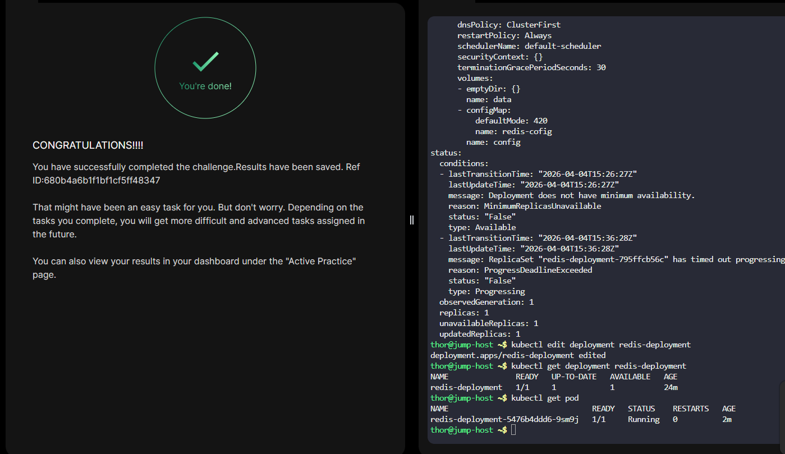

# Day 59 - Troubleshoot Deployment Issues in Kubernetes

## Task Summary

A Redis application deployed on a Kuber netes cluster became unavailable after recent configuration changes. The pods managed by the `redis-deployment` were no longer reaching the `Running` state.

The objective is to troubleshoot the Deployment, identify the root causes, and apply the necessary fixes to restore the application.


### Identified Issues
During analysis, two key misconfigurations were discovered:

- **Incorrect Redis image name**
  - Configured: `redis:alpin`
  - Correct: `redis:alpine`

- **Invalid ConfigMap reference**
  - Referenced: `redis-conig`
  - Actual: `redis-config`

These errors caused:
- Image pull failures due to an invalid image tag
- Volume mount failures because the referenced ConfigMap did not exist

---

## Resolution Steps
- Updated the Deployment with the correct Redis image (`redis:alpine`)
- Fixed the ConfigMap name to `redis-config`
- Saved the changes, allowing Kubernetes to automatically recreate the pods
- Monitored the pods until they successfully transitioned to the `Running` state


### Commands Used
```bash
# View deployment configuration
kubectl get deploy redis-deployment -o yaml

# Check pod status
kubectl get pods

# Inspect failing pod for errors
kubectl describe pod redis-deployment

# List available ConfigMaps
kubectl get cm

# Edit deployment to apply fixes
kubectl edit deploy redis-deployment

# Verify deployment and pod health
kubectl get deploy
kubectl get pods
```



## Outcome

* The `redis-deployment` is successfully updated
* New pods are created using the correct Redis image
* The ConfigMap is properly mounted
* Pods reach and remain in the `Running` state
* The Redis application is restored and fully operational


## Key Takeaways

* Minor typos in image names can completely block pod startup
* Incorrect ConfigMap references lead to volume mounting failures
* `kubectl describe pod` is essential for diagnosing issues
* Kubernetes self-heals by recreating pods after Deployment updates
* Always validate resource names (images, ConfigMaps) during configuration
* Most Kubernetes issues stem from configuration errors rather than application code