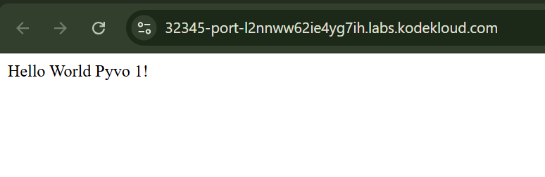

# Day 64 - Fix Python App on Kubernetes

## Task/Requirement

One of the DevOps engineers was trying to deploy a python app on Kubernetes cluster. Unfortunately, due to some mis-configuration, the application is not coming up. Please take a look into it and fix the issues. Application should be accessible on the specified nodePort.

The deployment name is `python-deployment-devops`, its using `poroko/flask-demo-app image`. The deployment and service of this app is already deployed.

`nodePort` should be `32345` and `targetPort` should be python flask app's default port.

## Task Overview
A Python Flask application deployed on a Kubernetes cluster was failing due to misconfiguration. The goal was to troubleshoot the existing Deployment and Service (`python-deployment-devops`) and ensure the application becomes accessible via a NodePort service.

This scenario mirrors real-world production incidents where misconfigured ports or services can cause application downtime.

---

## Problem Statement
- Deployment: `python-deployment-devops`
- Image: `poroko/flask-demo-app`
- Application not accessible
- Service misconfiguration suspected
- Required:
  - `nodePort`: **32345**
  - `targetPort`: Flask default port


## Issue Identified

During investigation, the application Pods were not starting. Running:

```bash
kubectl get pods
````

revealed a **`ImagePullBackOff`** error.

Further inspection:

```bash
kubectl describe pod <pod-name>
```

showed:

```
Error from server (BadRequest): container "python-container-devops" is waiting to start: trying and failing to pull image
```

### Root Cause

Two misconfigurations were identified:

1. **Incorrect Container Image**

   * Configured: `poroko/flask-app-demo`
   * Correct: `poroko/flask-demo-app`
   * Result: Kubernetes could not pull the image, preventing the Pod from starting.

2. **Wrong Service Target Port**

   * Configured: `targetPort: 8080`
   * Expected: `targetPort: 5000` (default Flask port)
   * Result: Even if the Pod started, traffic would not be routed correctly.

---

### Resolution Steps

#### 1. Fix Deployment Image

```bash
kubectl edit deployment python-deployment-devops
```

Update the container image:

```yaml
containers:
  - name: python-container-devops
    image: poroko/flask-demo-app
```

Apply and verify:

```bash
kubectl get pods
```

Pods should transition to **Running** state.

---

#### 2. Fix Service Port Configuration

```bash
kubectl edit svc <service-name>
```

Update ports:

```yaml
spec:
  type: NodePort
  ports:
    - port: 80
      targetPort: 5000
      nodePort: 32345
```

---

###  Validation

* Confirm Pods are running:

```bash
kubectl get pods
```

* Confirm Service configuration:

```bash
kubectl get svc
```

* Access application:

```
http://<Node-IP>:32345
```

---

###  Outcome

* Pods successfully pulled the correct image and started running.
* Service correctly routed traffic to the Flask application.
* Application became accessible via the specified NodePort.

---

### Key Takeaways
- `ImagePullBackOff` occurs when Kubernetes cannot pull the container image due to incorrect image name, tag, or registry access issues
- Always verify the exact image name and tag specified in deployment manifests
Container images must be accessible from the cluster for pods to start successfully
- A mismatch between service targetPort and the container’s listening port can cause gateway errors
- Systematic inspection of deployment, pod, and service resources helps quickly identify root causes
