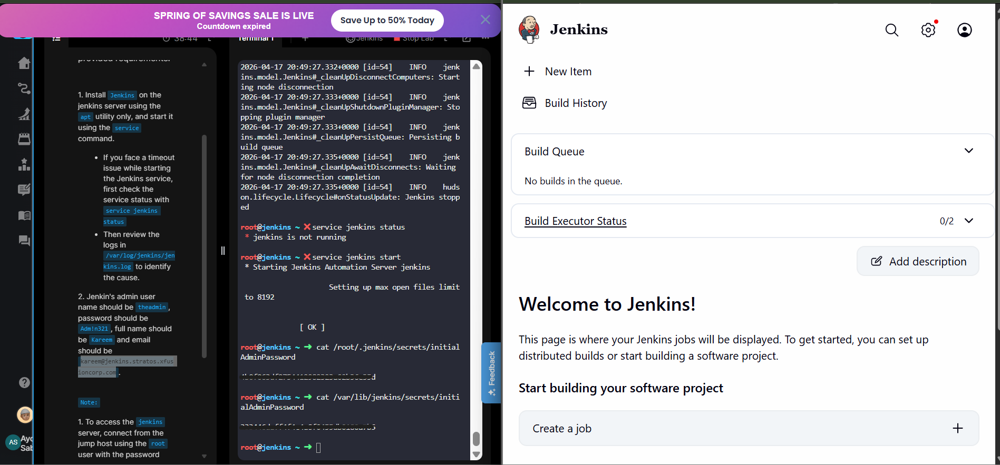

# Day 68 - Set Up Jenkins Server

## Task/Requirement

The DevOps team at xFusionCorp Industries is initiating the setup of CI/CD pipelines and has decided to utilize Jenkins as their server. Execute the task according to the provided requirements:

1. Install Jenkins on the jenkins server using the apt utility only, and start it using the service command. If you face a timeout issue while starting the Jenkins service, first check the service status with service jenkins status
Then review the logs in /var/log/jenkins/jenkins.log to identify the cause.

2. Jenkin's admin user name should be `theadmin`, password should be `Adm!n321`, full name should be `Jim` and email should be `jim@jenkins.stratos.xfusioncorp.com`.


Note:

- To access the jenkins server, connect from the jump host using the root user with the password S3curePass.

- After Jenkins server installation, click the Jenkins button on the top bar to access the Jenkins UI and follow on-screen instructions to create an admin user.


## Task Summary

The DevOps team at xFusionCorp Industries initiated the setup of a CI/CD pipeline by deploying a Jenkins server. The objective was to install Jenkins using the `apt` package manager, ensure the service is running, and configure an admin user via the Jenkins UI.

This simulates a real-world scenario where Jenkins is provisioned on a Linux server as part of a production CI/CD stack.

---

## Objectives

* Install Jenkins using `apt`
* Start and verify Jenkins service
* Troubleshoot service issues if any
* Configure initial admin user via Jenkins UI

---

## Server Access

```bash
ssh root@<jenkins-server>
```

---

## Step-by-Step Implementation

### 1. Update System Packages

```bash
apt update
```

---

### 2. Install Java 21

Jenkins requires Java to run.

```bash
apt install openjdk-21-jdk -y
```

Verify installation:

```bash
java -version
```

---

### 3. Add the Jenkins APT Repository

```bash
curl -fsSL https://pkg.jenkins.io/debian-stable/jenkins.io-2023.key \
  | tee /usr/share/keyrings/jenkins-keyring.asc > /dev/null

echo "deb [signed-by=/usr/share/keyrings/jenkins-keyring.asc] \
  https://pkg.jenkins.io/debian-stable binary/" \
  | tee /etc/apt/sources.list.d/jenkins.list > /dev/null


```
---

### 4. Install Jenkins via apt

```bash
apt update
apt install -y jenkins
```

---

### 5. Start Jenkins Using the service Command

```bash
service jenkins start
```


Verify status:

```bash
service jenkins status
```

---

## Issues Encountered & Resolutions

### 1. GPG Key Error (`NO_PUBKEY`)

* **Issue:** APT could not verify the Jenkins repository due to missing/invalid GPG key.
```
wget -q -O - https://pkg.jenkins.io/debian/jenkins.io.key | apt-key add -
echo "deb https://pkg.jenkins.io/debian binary/" > /etc/apt/sources.list.d/jenkins.list
```

* **Fix:** Replaced deprecated `apt-key` with a secure keyring approach using:

  ```bash
  /usr/share/keyrings + signed-by
  ```
```bash
curl -fsSL https://pkg.jenkins.io/debian-stable/jenkins.io-2023.key \
  | tee /usr/share/keyrings/jenkins-keyring.asc > /dev/null

echo "deb [signed-by=/usr/share/keyrings/jenkins-keyring.asc] \
  https://pkg.jenkins.io/debian-stable binary/" \
  | tee /etc/apt/sources.list.d/jenkins.list > /dev/null
  ```
  
  This explicitly bound the repository to its signing key.

---

### 2. Package Not Found (`No installation candidate`)

* **Issue:** Jenkins package was unavailable because the repository was ignored.
* **Fix:** Corrected the repository configuration (`debian-stable`) and re-ran `apt update` to properly load package metadata.

---

### 3. Jenkins Failed to Start (Java Version Mismatch)

* **Issue:** Jenkins required Java 21 but the system had Java 17.
```
cat /var/log/jenkins/jenkins.log
```
```
Running with Java 17 from /usr/lib/jvm/java-17-openjdk-amd64, which is older than the minimum required version (Java 21).
Supported Java versions are: [21, 25]
```

* **Fix:** Installed OpenJDK 21, updated `JAVA_HOME`, and restarted the Jenkins service.
```
apt install openjdk-21-jdk -y
service jenkins restart
service jenkins status
```

---

## Access Jenkins UI

Click the **Jenkins button** on the top bar in the lab environment.

---

##  Setup and UI Configuration

1. Retrieve initial admin password:

   ```bash
   cat /var/lib/jenkins/secrets/initialAdminPassword
   ```

2. Unlock Jenkins in the browser

3. Install suggested plugins

---

## Create Admin User

Use the following credentials:

* **Username:** theadmin
* **Password:** Adm!n321
* **Full Name:** Jim
* **Email:** [jim@jenkins.stratos.xfusioncorp.com](mailto:jim@jenkins.stratos.xfusioncorp.com)

---

##  Verification

* Jenkins service is running
* UI is accessible
* Admin user successfully created
* Dashboard loads without errors


---

## Key Takeaways

* **Logs Are Critical:** Checking service status and logs (`/var/log/jenkins/jenkins.log`) is essential for **fast, accurate debugging**.
* **Modern APT Security Practices:** Learned to replace deprecated `apt-key` with **keyrings + `signed-by`**, ensuring secure and trusted repository management.
* **GPG Errors = Trust Issues:** Understood that errors like `NO_PUBKEY` are about **verification**, not connectivity - and require proper key association.
* **Repo Issues Affect Package Availability:** “No installation candidate” often means the **repository wasn’t loaded**, not that the package doesn’t exist.
* **Dependency Alignment Matters:** Jenkins requires **Java 21+**, highlighting the importance of matching application and runtime versions.
* **Installation ≠ Working Service:** A successful install must be followed by **service validation, configuration, and troubleshooting**.
* Proper service validation ensures CI/CD reliability
