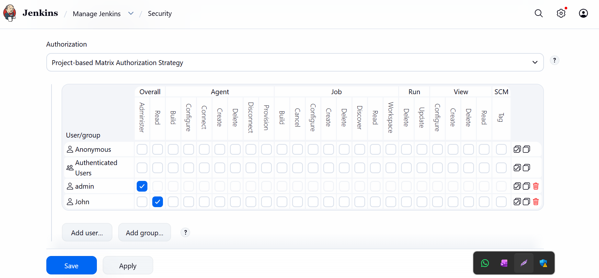

# Day 70 - Configure Jenkins User Access

## Task/Requirement

The Nautilus team is integrating Jenkins into their CI/CD pipelines. After setting up a new Jenkins server, they're now configuring user access for the development team, Follow these steps:

1. Click on the Jenkins button on the top bar to access the Jenkins UI. Login with username admin and password Adm!n321.

2. Create a jenkins user named john with the password 8FmzjvFU6S. Their full name should match John.

3. Utilize the Project-based Matrix Authorization Strategy to assign overall read permission to the john user.

4. Remove all permissions for Anonymous users (if any) ensuring that the admin user retains overall Administer permissions.

5. For the existing job, grant john user only read permissions, disregarding other permissions such as Agent, SCM etc.

Note:

1. You may need to install plugins and restart Jenkins service. After plugins installation, select Restart Jenkins when installation is complete and no jobs are running on plugin installation/update page.

2. After restarting the Jenkins service, wait for the Jenkins login page to reappear before proceeding. Avoid clicking Finish immediately after restarting the service.

3. Capture screenshots of your configuration for review purposes. Consider using screen recording software like loom.com for documentation and sharing. 

## Task Overview

In this task, we configured **user authentication and authorization in Jenkins** to enforce controlled access within a CI/CD environment. The objective was to create a new user and apply **role-based access control (RBAC)** using the **Project-based Matrix Authorization Strategy**, ensuring least-privilege access.

This mirrors real-world production setups where development teams require **restricted visibility and access** to CI/CD pipelines without compromising system integrity.

---

##  Step-by-Step Implementation

### 1. Access Jenkins Dashboard

* Open Jenkins UI
* Login using admin credentials

---

### 2. Create a New User

Navigate to:

`Manage Jenkins → Manage Users → Create User`

Provide:

* **Username:** `javed`
* **Password:** `8FmzjvFU6S`
* **Full Name:** `Javed`

Save the user.

---

### 3. Enable Matrix-Based Authorization

Go to:

`Manage Jenkins → Security`

* Under **Authorization**, select:

  * *Project-based Matrix Authorization Strategy*

>  If not available:

* Install plugin:

  * **Matrix Authorization Strategy Plugin**
* Restart Jenkins after installation

---

### 4. Assign Global Permissions

In the matrix table:

* Add user: `javed`
* Grant:

  * **Overall → Read**

Ensure:

* `admin` retains:

  * **Overall → Administer**

---

### 5. Remove Anonymous Access

* Locate `Anonymous` user in the matrix
* Remove all permissions

This ensures only authenticated users can access Jenkins.

---

### 6. Configure Job-Level Permissions

For the existing job:

* Open the job → **Configure**
* Enable:

  * *Project-based Matrix Authorization Strategy*

Add:

* User: `javed`
* Grant:

  * **Read**

> Do NOT assign:

* Build
* Configure
* Delete
* SCM
* Agent

---

## Verification

* Login as `john`
* Confirm:

  * Can view Jenkins dashboard
  * Can view the specific job
  * Cannot modify or trigger builds

---

## Key Takeaways

* Implemented **RBAC using Matrix Authorization Strategy**
* Enforced **principle of least privilege**
* Restricted anonymous access for improved security
* Applied both **global and project-level access control**

