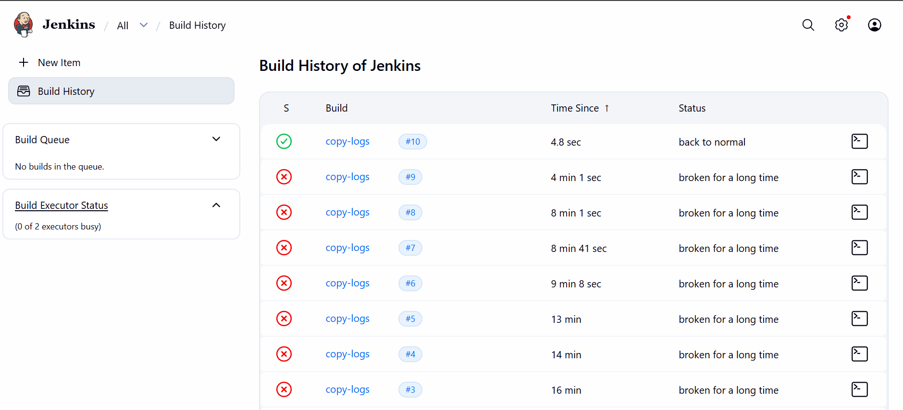

# Day 73 - Jenkins Scheduled Jobs – Automated Apache Log Collection

## Problem Statement

The devops team of xFusionCorp Industries is working on to setup centralised logging management system to maintain and analyse server logs easily. Since it will take some time to implement, they wanted to gather some server logs on a regular basis. At least one of the app servers is having issues with the Apache server. The team needs Apache logs so that they can identify and troubleshoot the issues easily if they arise. So they decided to create a Jenkins job to collect logs from the server. Please create/configure a Jenkins job as per details mentioned below:

Click on the Jenkins button on the top bar to access the Jenkins UI. Login using username admin and password Adm!n321

1. Create a Jenkins jobs named copy-logs.

2. Configure it to periodically build every 12 minutes to copy the Apache logs (both access_log and error_log) from App Server 1 (stapp01) from the default logs location to location `/usr/src/devops` on the Storage Server.

3. Build the job at least once so that the logs are copied and can be verified.

Note:

1. You might need to install some plugins and restart Jenkins. We recommend selecting Restart Jenkins when installation is complete and no jobs are running in the update centre. Refresh the page if the UI gets stuck after a restart.

2. Define the cron expression as required (e.g. */10 * * * * to run every 10 minutes).

---


## Task Overview

The objective of this task was to create a **scheduled Jenkins job** that runs every 12 minutes to collect Apache logs (`access_log` and `error_log`) from **App Server 1 (`stapp01`)** and store them on the **Storage Server (`ststor01`)** for centralized troubleshooting.

This mirrors a real production use case where teams need **interim log aggregation** before implementing a full observability stack such as ELK/EFK.

---

##  Implementation Steps

### 1. Access Jenkins

* Open Jenkins UI from the top bar
* Login with:

  * **Username:** `admin`
  * **Password:** `Adm!n321`

---

### 2. Create Jenkins Job

* Navigate to **New Item**
* Job name: `copy-logs`
* Select **Freestyle Project**
* Click **OK**

---

### 3. Configure Scheduled Build

Under **Build Triggers**:

* Enable **Build periodically**
* Add cron expression to run every 12 minutes:

```bash
*/12 * * * *
```

This ensures Jenkins acts as an automated scheduler similar to `cron`.

---

### 4. Configure Secure Log Copy Process

While adding the shell command, multiple issues had to be troubleshot and resolved.

---

## Issue 1: SSH Authentication Failure

### Error Encountered

```bash
Permission denied (publickey,gssapi-keyex,gssapi-with-mic,password)
```

### Root Cause

Jenkins runs jobs as the **SYSTEM / jenkins user**, which initially had **no SSH trust relationship** with either:

* `stapp01`
* `ststor01`

This prevented remote command execution.

---

### Resolution: Configure Key-Based Authentication

Switch to the Jenkins user:

```bash
sudo su - jenkins
```

Generate SSH key:

```bash
ssh-keygen -t rsa -b 4096
```

Press **Enter** through all prompts (no passphrase for automation).

Copy public key to both servers:

```bash
ssh-copy-id -i /var/lib/jenkins/.ssh/id_rsa.pub tony@stapp01
ssh-copy-id -i /var/lib/jenkins/.ssh/id_rsa.pub natasha@ststor01
```

This established passwordless SSH access from Jenkins to both servers.

---

## Issue 2: Command Execution Context Pitfall

### Initial Problem

The earlier command attempted:

```bash
ssh stapp01 "cat /var/log/httpd/access_log" > /usr/src/devops/access_log
```

This failed because the output redirection (`>`) happened on the **Jenkins server**, not the storage server.

This caused:

```bash
cannot create /usr/src/devops/access_log: Directory nonexistent
```

---

### Resolution: Use SSH Pipe Between Servers

The fix was to **pipe the log output from the app server into the storage server**:

```bash
ssh tony@stapp01 "cat /var/log/httpd/access_log" | ssh natasha@ststor01 "cat > /usr/src/devops/access_log"
ssh tony@stapp01 "cat /var/log/httpd/error_log" | ssh natasha@ststor01 "cat > /usr/src/devops/error_log"
```

This ensures:

* Log is read from `stapp01`
* Output is written directly on `ststor01`

This is a critical DevOps lesson in understanding **local vs remote shell execution context**.

---

## Issue 3: Permission Denied on Target Directory

### Error Encountered

```bash
bash: /usr/src/devops/access_log: Permission denied
```

### Root Cause

The `natasha` user did not have write access to:

```bash
/usr/src/devops
```

---

###  Resolution: Fix Ownership + Controlled Sudo Access

To resolve this securely, ownership and permissions were corrected on the storage server:

```bash
ssh natasha@ststor01 "sudo chown -R natasha:natasha /usr/src/devops"
```

For controlled privileged write access, the final production-safe command used `sudo tee`:

```bash
ssh tony@stapp01 "cat /var/log/httpd/access_log" | ssh natasha@ststor01 "sudo tee /usr/src/devops/access_log > /dev/null"
ssh tony@stapp01 "cat /var/log/httpd/error_log" | ssh natasha@ststor01 "sudo tee /usr/src/devops/error_log > /dev/null"
```

This approach avoids direct shell redirection permission issues.

---

## 5. Install Required Plugins

Go to:

**Manage Jenkins → Plugins**

Install:

* **SSH Plugin**

Restart Jenkins after installation.

---

## 6. Build and Verify

Click **Build Now**

Verify logs on the storage server:

```bash
ls -l /usr/src/devops
```

Expected output:

* `access_log`
* `error_log`

---

## Key Outcome

* Automated Apache log collection every 12 minutes
* Secure SSH-based automation across servers
* Logs centralized for troubleshooting and monitoring
* Multiple real-world issues identified and resolved




---

## Key Takeaways

* Jenkins can function as a lightweight scheduler
* SSH key-based authentication is essential for automation
* Understanding shell execution context prevents remote command errors
* Proper file ownership and sudo controls are critical in production
* Centralized logs improve troubleshooting and incident response

