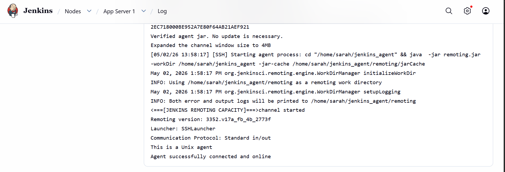
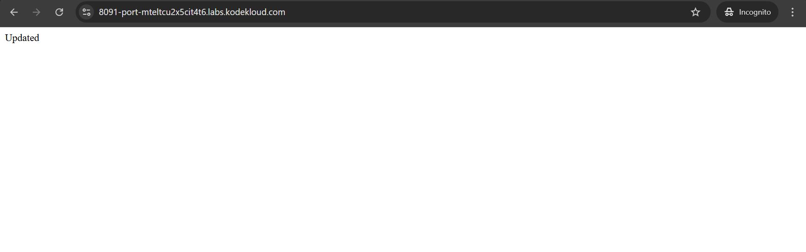
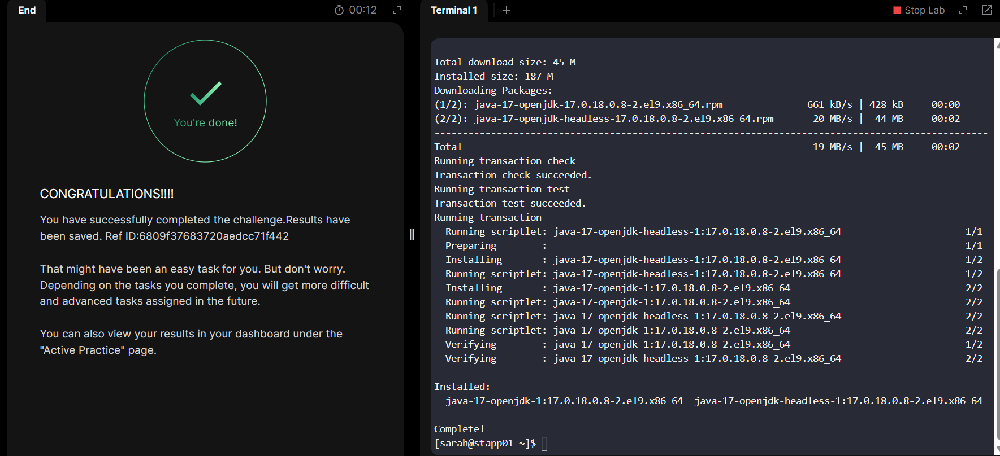

# Day 78 - Jenkins Conditional Pipeline

## Problem Statement

The development team of xFusionCorp Industries is working on to develop a new static website and they are planning to deploy the same on Nautilus App Server using Jenkins pipeline. They have shared their requirements with the DevOps team and accordingly we need to create a Jenkins pipeline job. Please find below more details about the task:

Click on the Jenkins button on the top bar to access the Jenkins UI. Login using username admin and password Adm!n321.

Similarly, click on the Gitea button on the top bar to access the Gitea UI. Login using username sarah and password Sarah_pass123. There under user sarah you will find a repository named web_app that is already cloned on App Server 1 under /var/www/html. sarah is a developer who is working on this repository.

Add a slave node named App Server 1. It should be labeled as stapp01 and its remote root directory should be /home/sarah/jenkins_agent (the repository is cloned under /var/www/html).

We have already cloned repository on App Server 1 under /var/www/html.

Apache is already installed on the app server and is running on port 8080.

Create a Jenkins pipeline job named xfusion-webapp-job (it must not be a Multibranch pipeline) and configure it to:

Add a string parameter named BRANCH.

It should conditionally deploy the code from web_app repository under /var/www/html on App Server 1, as this is the document root of the app server. The pipeline should have a single stage named Deploy ( which is case sensitive ) to accomplish the deployment.

The pipeline should be conditional, if the value master is passed to the BRANCH parameter then it must deploy the master branch, on the other hand if the value feature is passed to the BRANCH parameter then it must deploy the feature branch.

LB server is already configured. You should be able to see the latest changes you made by clicking on the App button. Please make sure the required content is loading on the main URL https://<LBR-URL> i.e there should not be a sub-directory like https://<LBR-URL>/web_app etc.


## Task Summary

Create a Jenkins **Pipeline job** that conditionally deploys the `web_app` static website to **App Server 1** based on the `BRANCH` parameter.

- `BRANCH=master` → deploy `master` branch
- `BRANCH=feature` → deploy `feature` branch

Deployment must happen directly in:

```bash
/var/www/html
````

so the app loads from:

```text
https://<LBR-URL>
```

and not:

```text
https://<LBR-URL>/web_app
```

---

## Step 1: Add Jenkins Slave Node

Go to:

```text
Manage Jenkins → Nodes → New Node
```

Create:

* **Name:** `App Server 1`
* **Type:** Permanent Agent

Configure:

* **Remote root directory:** `/home/sarah/jenkins_agent`
* **Label:** `stapp01`
* **Launch method:** Launch agents via SSH
* **Host:** `stapp01`

Add SSH credentials:

* **Username:** `sarah`
* **Password:** `Sarah_pass123`

Save and confirm the agent is online.



---

## Step 2: Create Pipeline Job

Go to:

```text
New Item
```

Create:

* **Job Name:** `xfusion-webapp-job`
* **Type:** `Pipeline`

> Do not use Multibranch Pipeline

---

## Step 3: Add Parameter

Under **General**:

Enable:

```text
This project is parameterized
```

Add:

```text
String Parameter
```

Set:

* **Name:** `BRANCH`
* **Default Value:** `master`

---

## Step 4: Add Pipeline Script

Use this pipeline script:

```groovy
pipeline {
    agent {
        label 'stapp01'
    }

    parameters {
        string(name: 'BRANCH', defaultValue: 'master', description: 'Branch to deploy')
    }

    stages {
        stage('Deploy') {
            steps {
                script {
                    if (params.BRANCH == 'master') {
                        sh '''
                            cd /var/www/html
                            git checkout master
                            git pull origin master
                        '''
                    } else if (params.BRANCH == 'feature') {
                        sh '''
                            cd /var/www/html
                            git checkout feature
                            git pull origin feature
                        '''
                    } else {
                        error("Use master or feature only")
                    }
                }
            }
        }
    }
}
```

Save the job.

---

## Step 5: Build and Verify

Click:

```text
Build with Parameters
```

Test both:

* `BRANCH=master`
* `BRANCH=feature`

Then click the **App** button and confirm the latest changes are visible on the main URL.


---

## Outcome

A conditional Jenkins pipeline successfully deploys different branches based on user input, simulating a real production deployment workflow using Jenkins agents and parameterized builds.



---

## Key Takeaways

* Jenkins conditional pipelines improve deployment control
* Parameters make deployments flexible and production-friendly
* Agent nodes allow remote deployment execution
* Proper ownership and Git permissions are critical
* Deploying directly to document root avoids web routing issues

