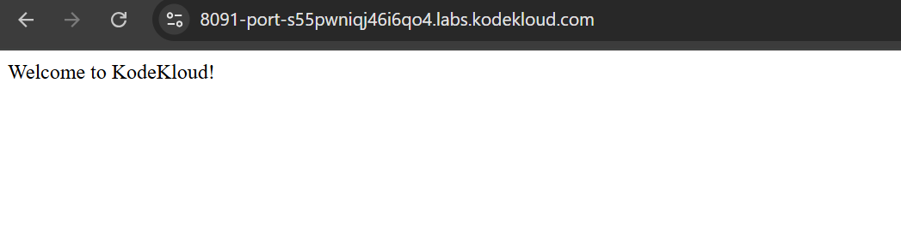

# Day 80 - Jenkins Chained Builds

## Problem Statement

The DevOps team was looking for a solution where they want to restart Apache service on all app servers if the deployment goes fine on these servers in Stratos Datacenter. After having a discussion, they came up with a solution to use Jenkins chained builds so that they can use a downstream job for services which should only be triggered by the deployment job. So as per the requirements mentioned below configure the required Jenkins jobs.

Click on the Jenkins button on the top bar to access the Jenkins UI. Login using username admin and Adm!n321 password.

Similarly you can access Gitea UI on port 3000 (or click the Gitea button) and username and password for Git is sarah and Sarah_pass123 respectively. Under user sarah you will find a repository named web.

Apache is already installed and configured on the app server. The doc root /var/www/html on App Server 1 is a local git repository tracking the origin web repository.

1. Create a Jenkins job named xfusion-app-deployment and configure it to pull changes from the master branch of the web repository on App Server 1 under /var/www/html directory.

2. Create another Jenkins job named manage-services and make it a downstream job for xfusion-app-deployment. Things to take care about this job are:

a. This job should restart httpd service on the app server (App Server 1).

b. Trigger this job only if the upstream job i.e xfusion-app-deployment is stable.

The LB server is already configured. Click on the App button on the top bar to access the app. Please make sure the required content is loading on the main URL (e.g. http://stlb01:8091) i.e there should not be a sub-directory like http://stlb01:8091/web etc.

Note:

1. You might need to install some plugins and restart Jenkins service. So, we recommend clicking on Restart Jenkins when installation is complete and no jobs are running on plugin installation/update page i.e update centre. Also some times Jenkins UI gets stuck when Jenkins service restarts in the back end so in such case please make sure to refresh the UI page.

2. Make sure Jenkins job passes even on repetitive runs as validation may try to build the job multiple times.

3. Deployment related tasks should be done by sudo user on the destination server to avoid any permission issues so make sure to configure your Jenkins job accordingly.

---

## Task Summary

The objective was to configure Jenkins chained builds so that after a successful deployment of the application code on App Server 1, a downstream job automatically restarts the Apache (`httpd`) service.

This ensures service restart only happens after a stable deployment, which reflects a proper CI/CD production workflow.

---

## Step-by-Step Walkthrough

### Step 1: Access Jenkins

- Open Jenkins from the top bar
- Login with the credentials provided


---

### Step 2: Verify the Git Repository

- Open Gitea from the top bar
- Login with the credentials provided

- Confirm the repository named:

```text
web
````

* Verify the branch is:

```text
master
```

---

### Step 3: Configure Passwordless SSH Access

Since Jenkins must deploy code on App Server 1 remotely, passwordless SSH was required.

Switch to the Jenkins user and generate SSH keys:

```bash
sudo su - jenkins
ssh-keygen
ssh-copy-id sarah@stapp01
```

This allowed Jenkins to connect to App Server 1 without password prompts.

---

### Step 4: Configure Sudo Permissions on App Server 1

SSH into App Server 1 and update the sudoers file:

```bash
ssh sarah@stapp01
sudo visudo
```

Add:

```bash
sarah ALL=(ALL) NOPASSWD: ALL
```

This ensured deployment and service restart commands could run without interactive password requests.

---

### Step 5: Create Upstream Job - xfusion-app-deployment

Create a new Freestyle Project named:

```text
xfusion-app-deployment
```

Under **Build → Execute Shell**, add:

```bash
ssh tony@stapp01 "cd /var/www/html && sudo git pull origin master"
```

This pulls the latest code from the `master` branch directly into Apache’s document root.

Save the job.

---

### Step 6: Create Downstream Job - manage-services

Create another Freestyle Project named:

```text
manage-services
```

Under **Build → Execute Shell**, add:

```bash
ssh sarah@stapp01 "sudo systemctl restart httpd"
```

This restarts Apache after deployment is completed.

Save the job.

---

### Step 7: Configure Chained Build Trigger

Open:

```text
xfusion-app-deployment → Configure
```

Under **Post-build Actions**, select:

```text
Build other projects
```

Add:

```text
manage-services
```

Then select:

```text
Trigger only if build is stable
```

This ensures the downstream job only runs after a successful deployment.

Save the configuration.

---

### Step 8: Build and Validate

Click:

```text
Build Now
```

on:

```text
xfusion-app-deployment
```

Confirm:

* Upstream job completes successfully
* Downstream job triggers automatically
* Application loads correctly from:

```text
http://stlb01:8091
```

and not from a subdirectory like `/web`.

---

## Challenges Faced and Resolution

### 1. Sudo Password Prompt Failure

### Problem

Using:

```bash
sudo su -
```

inside Jenkins failed with:

```text
sudo: a terminal is required
sudo: a password is required
```


### Resolution

Instead of interactive sudo, passwordless sudo was configured on App Server 1 by adding:

```bash
sarah ALL=(ALL) NOPASSWD: ALL
```

inside the sudoers file using `visudo`.

This allowed Jenkins to execute deployment and service restart commands non-interactively.

---

### 2. SSH Authentication Failure

### Problem

Jenkins could not connect to App Server 1 automatically because SSH required a password.

### Resolution

Generated SSH keys for the Jenkins user and copied the public key to App Server 1:

```bash
ssh-keygen
ssh-copy-id sarah@stapp01
```

This enabled passwordless SSH access required for automated builds.

---

### 3. Deployment Running on Wrong Server

### Problem

Initially, deployment commands were executed on the Jenkins server instead of App Server 1.


### Resolution

Deployment was changed to run remotely using:

```bash
ssh sarah@stapp01 "cd /var/www/html && sudo git pull origin master"
```

This ensured code was updated in the correct Apache document root on App Server 1.

---

## Outcome

* Jenkins successfully deployed code from Git to App Server 1
* Apache restarted only after successful deployment
* Upstream and downstream jobs were properly chained
* Application loaded successfully via the load balancer
* Repetitive validation builds passed successfully



