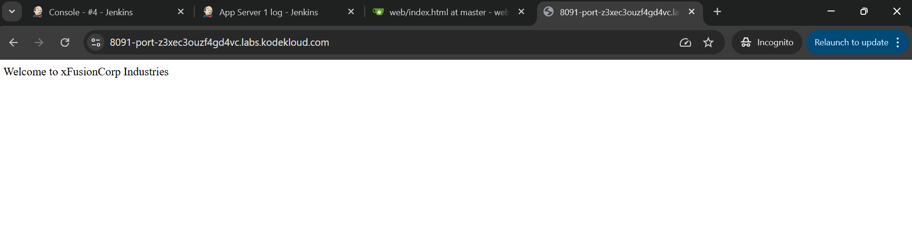

# Day 81 - Jenkins Multistage Pipeline Deployment

## Problem Statement

The development team of xFusionCorp Industries is working on to develop a new static website and they are planning to deploy the same on Nautilus App Server using Jenkins pipeline. They have shared their requirements with the DevOps team and accordingly we need to create a Jenkins pipeline job. Please find below more details about the task:

Click on the Jenkins button on the top bar to access the Jenkins UI. Login using username admin and password Adm!n321.

Similarly, click on the Gitea button on the top bar to access the Gitea UI. Login using username sarah and password Sarah_pass123.

There is a repository named sarah/web in Gitea that is already cloned on App Server 1 under /var/www/html directory.

Update the content of the file index.html under the same repository to Welcome to xFusionCorp Industries and push the changes to the origin into the master branch.

Apache is already installed on the app server and is running on port 8080.

Add App Server 1 as a Jenkins agent (slave) node: name App Server 1, label stapp01, remote root directory /home/sarah/jenkins_agent, launch via SSH with host stapp01 and credentials for user sarah. Install java-17-openjdk on App Server 1 if needed.

Create a Jenkins pipeline job named deploy-job (it must not be a Multibranch pipeline job) and pipeline should have two stages Deploy and Test ( names are case sensitive ). Configure these stages as per details mentioned below.

a. The Deploy stage should deploy the code from web repository under /var/www/html on App Server 1, as this is the document root of the app server.

b. The pipeline should run on the App Server 1 node (e.g. use label stapp01).

c. The Test stage should just test if the app is working fine and website is accessible. Its up to you how you design this stage to test it out, you can simply add a curl command as well to run a curl against the LBR URL (http://stlb01:8091) to see if the website is working or not. Make sure this stage fails in case the website/app is not working or if the Deploy stage fails.

Click on the App button on the top bar to see the latest changes you deployed. Please make sure the required content is loading on the main URL http://stlb01:8091 i.e there should not be a sub-directory like http://stlb01:8091/web etc.

Note:

You might need to install some plugins and restart Jenkins service. So, we recommend clicking on Restart Jenkins when installation is complete and no jobs are running on plugin installation/update page i.e update centre. Also, Jenkins UI sometimes gets stuck when Jenkins service restarts in the back end. In this case, please make sure to refresh the UI page.

---

## Task Summary

The objective of this task was to create a Jenkins multistage pipeline to deploy a static website from a Gitea repository to Nautilus App Server 1 and validate the deployment automatically using a test stage.

The pipeline needed to:

* Update the website content in the Git repository
* Configure App Server 1 as a Jenkins agent node
* Create a Jenkins pipeline job named `deploy-job`
* Run the job on the Jenkins agent using label `stapp01`
* Deploy the latest code to `/var/www/html`
* Verify the deployment using a curl test against the load balancer URL

---

## Walkthrough Steps

### Step 1: Update Website Content in Repository

SSH into App Server 1 and move to the cloned repository:

```bash
ssh sarah@stapp01
cd /var/www/html
```

Update the `index.html` file:

```bash
echo "Welcome to xFusionCorp Industries" > index.html
```

Commit and push the changes:

```bash
git add index.html
git commit -m "Updated homepage content"
git push origin master
```

This ensures Jenkins deploys the latest version from the `master` branch.


### Step 2: Install Java on App Server 1

Jenkins agents require Java to connect successfully.

```bash
sudo yum install java-17-openjdk -y
```

Verify installation:

```bash
java -version
```


### Step 3: Add App Server 1 as Jenkins Agent Node

Navigate to:

```text
Manage Jenkins → Nodes → New Node
```

Configure the node:

#### Basic Configuration

* Name: `App Server 1`
* Type: Permanent Agent

#### Node Settings

* Number of executors: `1`
* Remote root directory: `/home/sarah/jenkins_agent`
* Labels: `stapp01`
* Usage: Use this node as much as possible

#### Launch Method

Select:

```text
Launch agents via SSH
```

Add:

* Host: `stapp01`
* Credentials: SSH credentials for user `sarah`

Save and confirm the node status shows online.


### Step 4: Create Jenkins Pipeline Job

Navigate to:

```text
New Item → deploy-job
```

Select:

```text
Pipeline
```

> Important: Do not select Multibranch Pipeline


### Step 5: Configure the Pipeline Script

Use the following Jenkins pipeline:

```groovy
pipeline {
    agent { label 'stapp01' }

    stages {

        stage('Deploy') {
            steps {
                dir('/var/www/html') {
                    sh '''
                        git pull origin master
                    '''
                }
            }
        }

        stage('Test') {
            steps {
                sh '''
                    curl -f http://stlb01:8091
                '''
            }
        }
    }
}
```

### Stage Breakdown

#### Deploy Stage

This stage pulls the latest code from the master branch into:
```
/var/www/html
```
This is the Apache document root, ensuring the website loads directly from:
```
http://stlb01:8091
```
and not from:
```
http://stlb01:8091/web
```

#### Test Stage

This stage verifies that the website is accessible using:

```bash
curl -f http://stlb01:8091
```

The `-f` flag causes the build to fail if the application is unreachable or returns an error response.

This helps prevent silent deployment failures.


---

## Verification

After a successful pipeline build:

* Click the **App** button on the top bar
* Confirm the website loads successfully on:

```text
http://stlb01:8091
```

Expected output:

```text
Welcome to xFusionCorp Industries
```



---

## Errors Encountered and Resolutions


### Error 1: Jenkins Could Not Write to `/var/www/html`

#### Error Message

```text
java.nio.file.AccessDeniedException: /var/www/html@tmp
```

#### Cause

Jenkins attempted to create a temporary working directory:

```text
/var/www/html@tmp
```

but the Jenkins agent user (`sarah`) did not have permission to write inside `/var/www/html`.

This caused the Deploy stage to fail and the Test stage to be skipped.

#### Resolution

Updated ownership and permissions:

```bash
sudo chown -R sarah:sarah /var/www/html
sudo chmod -R 755 /var/www/html
```

This allowed Jenkins to access and manage files inside the deployment directory.

#### Alternative Resolution

Instead of using dir('/var/www/html'), use direct commands with proper permissions:

```groovy
pipeline {
    agent { label 'stapp01' }

    stages {

        stage('Deploy') {
            steps {
                sh '''
                    cd /var/www/html
                    git pull origin master
                '''
            }
        }

        stage('Test') {
            steps {
                sh '''
                    curl -f http://stlb01:8091
                '''
            }
        }
    }
}
```


This avoids Jenkins trying to create extra temp directories inside dir().

---

### Error 2: Git Pull Failed Due to Local Changes

#### Error Message

```text
error: Your local changes to the following files would be overwritten by merge:
index.html
Please commit your changes or stash them before you merge.
```


#### Cause

The `index.html` file had already been modified locally on the server, so `git pull` refused to overwrite it.

This is common when files are manually edited directly on the server.

#### Resolution

Instead of using:

```bash
git pull origin master
```

the pipeline was updated to use:

```bash
git fetch origin
git reset --hard origin/master
```

As shown in the pipeline below:

```groovy
pipeline {
    agent { label 'stapp01' }

    stages {

        stage('Deploy') {
            steps {
                sh '''
                    cd /var/www/html
                    git fetch origin
                    git reset --hard origin/master
                '''
            }
        }

        stage('Test') {
            steps {
                sh '''
                    curl -f http://stlb01:8091
                '''
            }
        }
    }
}
```

Save the job and click **Build Now**.

Using:

```bash
git fetch origin
git reset --hard origin/master
```
ensures the deployment is always clean and matches the remote repository exactly.

This forces the server to exactly match the remote Git repository and avoids merge conflicts.

This is also a better production deployment strategy.

---

## Outcome

Successfully created a Jenkins multistage pipeline with:

* automated deployment from Gitea
* Jenkins agent execution on App Server 1
* deployment validation using curl
* proper production-safe Git deployment strategy
* resolution of permission and Git conflict issues


This task demonstrates a practical real-world CI/CD deployment workflow using Jenkins pipelines.