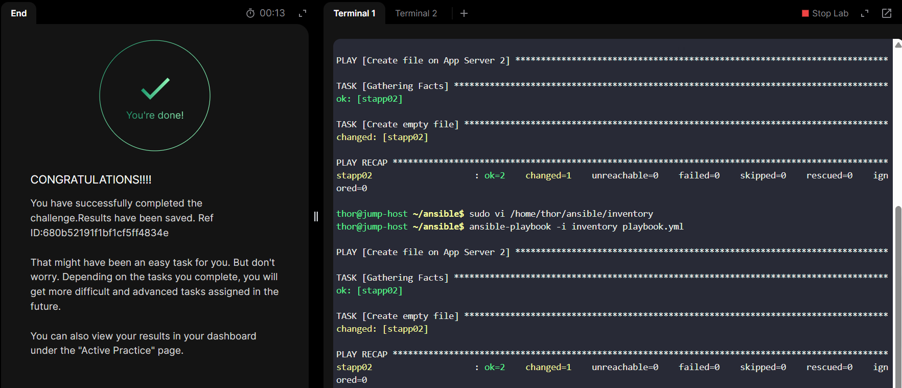

# Day 82 - Create Ansible Inventory for App Server Testing

## Problem Statement

An Ansible playbook needs completion on the jump host, where a team member left off. Below are the details:

The inventory file `/home/thor/ansible/inventory` requires adjustments. The playbook must run on App Server 2 in Stratos DC. Update the inventory accordingly.

Create a playbook `/home/thor/ansible/playbook.yml`. Include a task to create an empty file /tmp/file.txt on App Server 2.

Note: Validation will run the playbook using the command `ansible-playbook -i inventory playbook.yml`. Ensure the playbook works without any additional arguments.

---

## Task Summary 

This task focuses on configuring an Ansible inventory and creating a simple playbook to validate connectivity and task execution on a target server.

The goal is to ensure the playbook runs specifically on **App Server 2** in the **Stratos DC** environment and creates an empty file at `/tmp/file.txt`.

---

## Task Objective

Complete the Ansible setup on the jump host by:

* Updating the inventory file: `/home/thor/ansible/inventory`
* Targeting **App Server 2**
* Creating a playbook: `/home/thor/ansible/playbook.yml`
* Adding a task to create an empty file:

```bash
/tmp/file.txt
```

The playbook must run successfully using:

```bash
ansible-playbook -i inventory playbook.yml
```

without requiring any extra arguments.

---

## Solution Walkthrough

### Step 1: Navigate to the Ansible Directory

```bash
cd /home/thor/ansible
```


### Step 2: Update the Inventory File

Edit the inventory file:

```bash
vi inventory
```

Add the App Server 2 host entry:

```ini
stapp02 ansible_user=steve ansible_ssh_pass=Am3ric@ ansible_host=10.244.235.25  ansible_ssh_common_args='-o StrictHostKeyChecking=no'
```

#### Explanation of Variables

* `stapp02` → Required inventory hostname for App server 2
* `ansible_user` → SSH username used for login
* `ansible_ssh_pass` → SSH password
* `ansible_host` → Actual private IP address of the server
* `ansible_ssh_common_args` → to pass extra SSH options during server connections.

Ensure the correct IP of the server is used. This ensures Ansible knows which server to target during execution.


### Step 3: Create the Playbook

Create the playbook file:

```bash
vi playbook.yml
```

Add the following content:

```yaml
---
- name: Create file on App Server 2
  hosts: stapp02
  become: yes

  tasks:
    - name: Create empty file
      file:
        path: /tmp/file.txt
        state: touch
```


### Playbook Explanation

#### `hosts: stapp02`

Targets only App Server 2 from the inventory.

#### `become: yes`

Enables privilege escalation since writing to system paths may require elevated permissions.

#### `state: touch`

Creates the file if it does not exist and updates its timestamp if it already exists.

---

## Validation

Run the playbook using:

```bash
ansible-playbook -i inventory playbook.yml
```

Expected output should show:

```bash
changed=1
```

This confirms the file was created successfully.

---

## Outcome

* Inventory was correctly configured for App Server 2
* Playbook executed successfully
* `/tmp/file.txt` was created on the target server
* Ansible validated proper host targeting and remote task execution



This mirrors real production scenarios where infrastructure teams use inventory-driven automation to manage specific servers without manual intervention.

---

## Key Takeaway

A properly structured inventory is the backbone of Ansible automation.

Without accurate host definitions, even the best playbooks cannot execute correctly in production environments.

