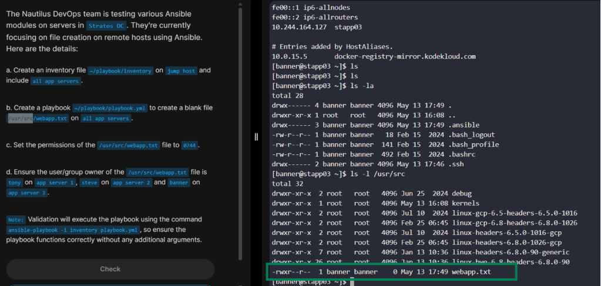

# Day 85 - Create Files on App Servers using Ansible

## Problem Statement

The Nautilus DevOps team is testing various Ansible modules on servers in Stratos DC. They're currently focusing on file creation on remote hosts using Ansible. Here are the details:

a. Create an inventory file ~/playbook/inventory on jump host and include all app servers.

b. Create a playbook ~/playbook/playbook.yml to create a blank file /usr/src/webapp.txt on all app servers.

c. Set the permissions of the /usr/src/webapp.txt file to 0744.

d. Ensure the user/group owner of the /usr/src/webapp.txt file is tony on app server 1, steve on app server 2 and banner on app server 3.

---

## Task Summary

- Create an inventory file containing all app servers
- Write a playbook to create `/usr/src/webapp.txt`
- Set file permissions to `0744`
- Assigned different ownership per server:
  - App Server 1 → `tony`
  - App Server 2 → `steve`
  - App Server 3 → `banner`

Validate runs using:

```bash
ansible-playbook -i inventory playbook.yml
```

---

## Solution Walkthrough

### Step 1: Create Inventory File

Create the inventory file:

```bash
sudo vi inventory
```

Add:

```ini
[app_servers]
stapp01 ansible_host=10.244.195.101 ansible_user=tony
stapp02 ansible_host=10.244.49.89 ansible_user=steve
stapp03 ansible_host=10.244.164.127 ansible_user=banner
```

Replace the IP addresses with the actual IPs of the servers. Log into each server and check the IP using:
```
cat /etc/hosts
```

### Step 2: Generate SSH Key on Jump Host

- Generate an SSH key pair:

```bash
ssh-keygen
```

- Copy the public key to each app server using the correct remote users:

```bash
ssh-copy-id tony@stapp01
ssh-copy-id steve@stapp02
ssh-copy-id banner@stapp03
```

- Enter the password once for each server.

- After this, passwordless SSH access is enabled.

This allows Ansible to connect securely using SSH keys instead of exposing passwords.

---

### Step 3: Create the Playbook

Create the playbook file:

```bash
sudo vi playbook.yml
```

Add:

```yaml
---
- name: Create file on app servers
  hosts: app_servers
  become: yes

  tasks:

    - name: Create blank file on App Server 1
      file:
        path: /usr/src/webapp.txt
        state: touch
        mode: '0744'
        owner: tony
        group: tony
      when: inventory_hostname == "stapp01"

    - name: Create blank file on App Server 2
      file:
        path: /usr/src/webapp.txt
        state: touch
        mode: '0744'
        owner: steve
        group: steve
      when: inventory_hostname == "stapp02"

    - name: Create blank file on App Server 3
      file:
        path: /usr/src/webapp.txt
        state: touch
        mode: '0744'
        owner: banner
        group: banner
      when: inventory_hostname == "stapp03"
```


### Step 4: Run the Playbook

Execute:

```bash
ansible-playbook -i inventory playbook.yml
```

If successful, Ansible will report changes made on all three servers.


### Step 5: Verify that the file was copied

You can confirm manually by SSHing into each server:

```bash
ls -l /usr/src/webapp.txt
```

Expected ownership:

```bash
-rwxr-xr-x
```

With owners:

* `tony`
* `steve`
* `banner`

depending on the server.



---

## Key Takeaway

The Ansible `file` module is a simple but powerful way to manage files remotely. It helps enforce consistency across infrastructure and reduces manual server administration.

This kind of task reflects real production workflows where infrastructure must remain predictable, secure, and repeatable through automation.


