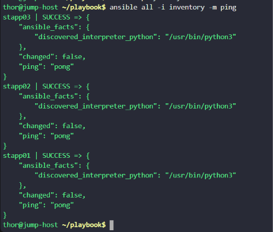

# Day 87 - Ansible Install Package Using Yum

## Problem Statement

The Nautilus Application development team wanted to test some applications on app servers in Stratos Datacenter. They shared some pre-requisites with the DevOps team, and packages need to be installed on app servers. Since we are already using Ansible for automating such tasks, please perform this task using Ansible as per details mentioned below:

Create an inventory file `/home/thor/playbook/inventory` on jump host and add all app servers in it.

Create an Ansible playbook `/home/thor/playbook/playbook.yml` to install logrotate package on all  app servers using Ansible yum module.


Make sure user thor should be able to run the playbook on jump host.

Note: Validation will try to run playbook using command ansible-playbook -i inventory playbook.yml so please make sure playbook works this way, without passing any extra arguments.

---

## Task Summary

The objective was to:

- Create an inventory file at `/home/thor/playbook/inventory`
- Add all app servers to the inventory
- Create an Ansible playbook at `/home/thor/playbook/playbook.yml`
- Use the Ansible `yum` module to install the `logrotate` package
- Ensure user `thor` can run the playbook using:

```bash
ansible-playbook -i inventory playbook.yml
```

without requiring extra arguments.

---

## Solution Walkthrough

### Step 1: Create the Inventory File

Create the inventory file:

```bash
vi /home/thor/playbook/inventory
```

Add all application servers:

```ini
[app_servers]
stapp01 ansible_user=tony
stapp02 ansible_user=steve
stapp03 ansible_user=banner
```

### Step 2: Configure SSH key-based authentication
Configure ssh key-based authentication so no password setup is needed.

```bash
ssh-keygen
```
Press Enter through the prompts to use default settings.

#### Transfer the public key to all the App Servers:

```bash
ssh-copy-id tony@stapp01
ssh-copy-id steve@stapp02
ssh-copy-id banner@stapp03
```
Enter the remote user passwords when prompted.
This allows future SSH access without a password.

### Step 3: Create the Playbook

Create the playbook file:

```bash
vi /home/thor/playbook/playbook.yml
```

Add the following content:

```yaml
---
- name: Install logrotate package on app servers
  hosts: app_servers
  become: yes

  tasks:
    - name: Install logrotate using yum
      yum:
        name: logrotate
        state: present
```

### Step 4: Verify Ansible Connectivity

Run:

```bash
ansible all -i inventory -m ping
```



This confirms the jump host can reach all app servers successfully.


### Step 5: Run the Playbook

Execute:

```bash
ansible-playbook -i inventory playbook.yml
```

Expected result:

```bash
changed=1
failed=0
```


