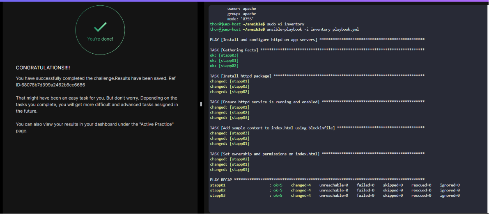

# Day 88 - Ansible Blockinfile Module | Configure Apache Web Server with Sample Page

## Problem Statement

The Nautilus DevOps team wants to install and set up a simple httpd web server on all app servers in Stratos DC. Additionally, they want to deploy a sample web page for now using Ansible only. Therefore, write the required playbook to complete this task. Find more details about the task below.

We already have an inventory file under `/home/thor/ansible` directory on jump host. Create a `playbook.yml` under `/home/thor/ansible` directory on jump host itself.

Using the playbook, install httpd web server on all app servers. Additionally, make sure its service should up and running.

Using blockinfile Ansible module add some content in `/var/www/html/index.html` file. Below is the content:

```bash
Welcome to XfusionCorp!
This is  Nautilus sample file, created using Ansible!
Please do not modify this file manually!
```

The `/var/www/html/index.html` file's user and group owner should be `apache` on all app servers.

The `/var/www/html/index.html` file's permissions should be `0755` on all app servers.

Note:

i. Validation will try to run the playbook using command `ansible-playbook -i inventory playbook.yml` so please make sure the playbook works this way without passing any extra arguments.

ii. Do not use any custom or empty marker for blockinfile module.

---

## Task Summary

The goal of this task is to use Ansible to automate the installation and configuration of the Apache (`httpd`) web server on all application servers in Stratos DC.

The playbook must:

- Install `httpd`
- Ensure the `httpd` service is started and enabled
- Create/update `/var/www/html/index.html` using the `blockinfile` module
- Set correct ownership:
  - User: `apache`
  - Group: `apache`
- Set correct permissions:
  - Mode: `0755`

The playbook must be created as:

`/home/thor/ansible/playbook.yml`

and should run successfully using:

```bash
ansible-playbook -i inventory playbook.yml
```  

without extra arguments.

---

## Solution Walkthrough

### Step 1: Navigate to Ansible Directory

```bash
cd /home/thor/ansible
```

This is where both the inventory file and playbook must exist.


### Step 2: Create the Playbook

```bash
sudo vi playbook.yml
```

Add the following content:

```yaml
---
- name: Install and configure httpd on app servers
  hosts: app_servers
  become: yes

  tasks:

    - name: Install httpd package
      yum:
        name: httpd
        state: present

    - name: Ensure httpd service is running and enabled
      service:
        name: httpd
        state: started
        enabled: yes

    - name: Add sample content to index.html using blockinfile
      blockinfile:
        path: /var/www/html/index.html
        create: yes
        block: |
          Welcome to XfusionCorp!
          This is Nautilus sample file, created using Ansible!
          Please do not modify this file manually!

    - name: Set ownership and permissions on index.html
      file:
        path: /var/www/html/index.html
        owner: apache
        group: apache
        mode: '0755'
```


### Step 3: Verify Inventory Group Name

Check the inventory file:

```bash
cat inventory
```

Make sure the app servers are under:

```ini
[app_servers]
```

If the actual group name is different (for example `[app]`), update the `hosts:` value in the playbook accordingly.


### Step 4: Run the Playbook

```bash
ansible-playbook -i inventory playbook.yml
```



This will install Apache, start the service, create the sample webpage, and apply the required permissions.


### Step 5: Validate

You can verify manually:

```bash
ansible app_servers -a "cat /var/www/html/index.html" -b
```

Also check:

```bash
ansible app_servers -a "ls -l /var/www/html/index.html" -b
```

Expected output should show:

* owner: apache
* group: apache
* permissions: `-rwxr-xr-x`

