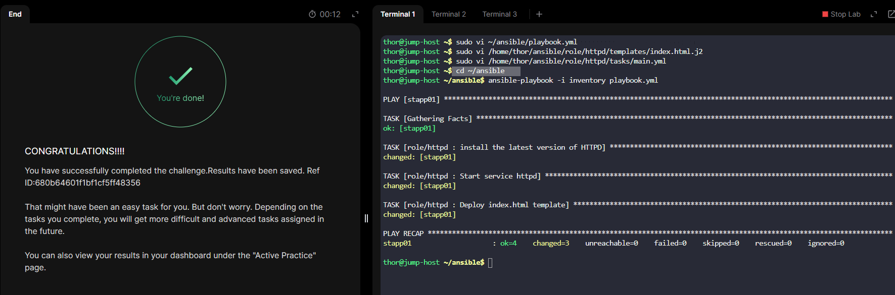
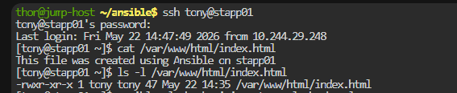

# Day 92 - Managing Jinja2 Templates Using Ansible

## Problem Statement

One of the Nautilus DevOps team members is working on to develop a role for httpd installation and configuration. Work is almost completed, however there is a requirement to add a jinja2 template for index.html file. Additionally, the relevant task needs to be added inside the role. The inventory file ~/ansible/inventory is already present on jump host that can be used. Complete the task as per details mentioned below:

a. Update ~/ansible/playbook.yml playbook to run the httpd role on App Server 1.

b. Create a jinja2 template index.html.j2 under /home/thor/ansible/role/httpd/templates/ directory and add a line This file was created using Ansible on <respective server> (for example This file was created using Ansible on stapp01 in case of App Server 1). Also please make sure not to hard code the server name inside the template. Instead, use inventory_hostname variable to fetch the correct value.

c. Add a task inside /home/thor/ansible/role/httpd/tasks/main.yml to copy this template on App Server 1 under /var/www/html/index.html. Also make sure that /var/www/html/index.html file's permissions are 0755.

d. The user/group owner of /var/www/html/index.html file must be respective sudo user of the server (for example tony in case of stapp01).

Note: Validation will try to run the playbook using command ansible-playbook -i inventory playbook.yml so please make sure the playbook works this way without passing any extra arguments.


## Task Summary

This task involves updating an existing Ansible role for Apache (`httpd`) configuration by:

* Running the `httpd` role on **App Server 1**
* Creating a **Jinja2 template** for `index.html`
* Deploying the template using the `template` module
* Setting correct:

  * permissions
  * ownership
  * dynamic hostname rendering using `inventory_hostname`


## Project Structure

```bash
/home/thor/ansible/
├── inventory
├── playbook.yml
└── role/
    └── httpd/
        ├── tasks/
        │   └── main.yml
        └── templates/
            └── index.html.j2
```

---

### Step 1: Update the Playbook

Edit:

```bash
vi ~/ansible/playbook.yml
```

Add:

```yaml
---
- hosts: stapp01
  become: yes

  roles:
    - httpd
```

#### Explanation

* `hosts: stapp01` → targets App Server 1
* `become: yes` → enables sudo privileges
* `roles:` → executes the `httpd` role


### Step 2: Create the Jinja2 Template

Create the template file:

```bash
vi /home/thor/ansible/role/httpd/templates/index.html.j2
```

Add:

```html
This file was created using Ansible on {{ inventory_hostname }}
```

#### Explanation

* `{{ inventory_hostname }}` dynamically prints the server hostname
* Avoids hardcoding values like `stapp01`

Expected output on App Server 1:

```text
This file was created using Ansible on stapp01
```


### Step 3: Add Template Task to Role

Edit:

```bash
vi /home/thor/ansible/role/httpd/tasks/main.yml
```

Add:

```yaml
---
- name: Deploy index.html template
  template:
    src: index.html.j2
    dest: /var/www/html/index.html
    owner: tony
    group: tony
    mode: '0755'
```

#### Explanation

* `template:` → copies and renders Jinja2 template
* `src:` → template inside `templates/`
* `dest:` → target location on App Server 1
* `owner/group:` → required sudo user for `stapp01`
* `mode: 0755` → sets executable permissions


### Step 4: Run the Playbook

Execute:

```bash
cd ~/ansible
ansible-playbook -i inventory playbook.yml
```




### Step 5: Verify on App Server 1

SSH into the server:

```bash
ssh tony@stapp01
```

Check file content:

```bash
cat /var/www/html/index.html
```

Expected:

```text
This file was created using Ansible on stapp01
```

Check permissions:

```bash
ls -l /var/www/html/index.html
```

Expected output:

```bash
-rwxr-xr-x 1 tony tony ...
```



---

## Key Learnings

**Ansible Roles** are used to organize automation into reusable and manageable components.

**Jinja2 Templates** are used to create dynamic files using variables instead of hardcoded values.

`inventory_hostname` is used to automatically retrieve the hostname of the target server from the inventory.

The Ansible `template` module is used to deploy and render Jinja2 templates on remote servers.

Role-based automation structure is used to keep Ansible projects clean, scalable, and easier to maintain.

