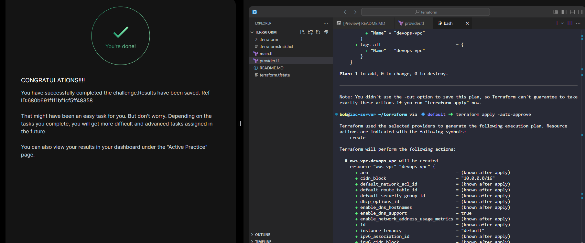

# Day 94 - Create VPC Using Terraform

## Task Objective

Create an AWS VPC named `devops-vpc` in the `us-east-1` region using Terraform.

The Terraform working directory is:

```bash
/home/bob/terraform
```

You must create only:

```bash
main.tf
```

> `provider.tf` is already provided by the lab environment.

---

## Step-by-Step Solution

### Step 1: Navigate to the Terraform Directory

```bash
cd /home/bob/terraform
```

### Step 2: Create the `main.tf` File

```bash
sudo vi main.tf
```

```hcl
resource "aws_vpc" "devops_vpc" {
  cidr_block = "10.0.0.0/16"

  tags = {
    Name = "devops-vpc"
  }
}
```

### Step 3: Initialize Terraform

```bash
terraform init
```
This downloads the AWS provider and initializes the working directory.

### Step 4: Validate the Configuration

```bash
terraform validate
```

### Step 5: Preview the Infrastructure Changes

```bash
terraform plan
```
This shows the VPC resource Terraform intends to create.

### Step 6: Apply the Configuration

```bash
terraform apply -auto-approve
```

---

## Verify the VPC

Run:

```bash
terraform state list
```

Expected output:

```bash
aws_vpc.devops_vpc
```

You can also inspect the created VPC:

```bash
terraform show
```


---

## Key DevOps Concepts Practiced

* Infrastructure as Code (IaC)
* AWS VPC provisioning
* Terraform resource management
* Terraform workflow:

  * `init`
  * `validate`
  * `plan`
  * `apply`
* AWS provider usage
* Resource tagging best practices
