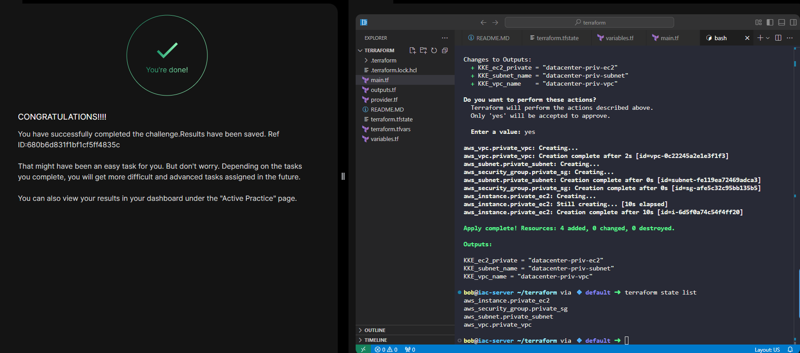

# Day 98 - Launch EC2 in a Private VPC Subnet Using Terraform

## Objective

Provision the following AWS resources using Terraform:

- VPC: datacenter-priv-vpc (10.0.0.0/16)
- Private Subnet: datacenter-priv-subnet (10.0.1.0/24)
- EC2 Instance: datacenter-priv-ec2 (t2.micro)
- Security Group allowing access only from within the VPC CIDR
- Use:
    - main.tf
    - variables.tf
    - outputs.tf
- `provider.tf` has already been preconfigured.

## Solution Steps

### Create:
```
- variables.tf
- terraform.tfvars
- main.tf
    - VPC
    - Subnet
    - Security Group: Only allow traffic originating from the VPC CIDR.
    - EC2 Instance
- outputs.tf
```
### Deploy and Verify

```bash
terraform init
terraform validate
terraform plan
terraform apply -auto-approve
```

Verify:

```bash
terraform state list
```
